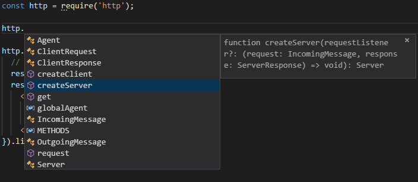
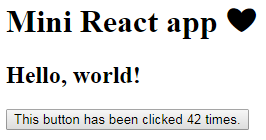
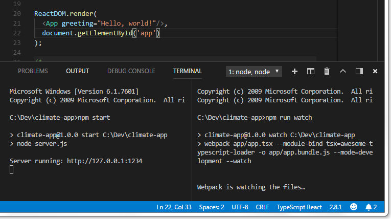

Setting up your TypeScript Project: 4 Different Approaches
==========================================================

Welcome to Part 2 of this series! Here we will go on a tour of the JavaScript tools ecosystem. This part is not about React (we'll get to that in [Part 5](tutorial-5.md)) but it does include a simple React component.

Actually this is a **grand** tour, and we'll talk about writing your app in four different ways:

- A. The Easiest Way (with Parcel)
- B. The Way of Fewest Tools (i.e. the do-it-yourself way)
- C. The Webpack way
- D. The Gulp way

Afterward there will be a summary to remind you of the key points.

Common Steps
------------

The first six steps are the same in all four approaches, so let's get started!

### Step 1: Install Node.js (with npm) ###

If you haven't yet, go [install Node.js](https://nodejs.org/en/download/) which will also install the command-line package manager, `npm`. (If you want to deploy your app on some other web server, I recommend worrying about how to do that later.)

### Step 2: Install Visual Studio Code or other editor (optional) ###

One of the main reasons to use TypeScript instead of JavaScript is that it supports code completion features (also known as IntelliSense).

To enjoy this benefit, you'll need to edit your TypeScript `.ts` files in a compatible editor such as [Visual Studio Code](https://code.visualstudio.com/download) - which is free and multiplatform. It's also the most popular text editor for JavaScript apps ([alternatives](https://stateofjs.com/2017/other-tools/) include Atom and Sublime Text.)

Visual Studio Code is folder-oriented: you open a folder in VS Code and that folder will be treated like the current "project". During installation (on Windows, anyway) it will offer a checkbox to add an "Open with Code" action for folders (directories). I recommend using that option as an easy way to start VS Code from any folder:

Create an empty folder for your app, then open that folder in VS Code. Notice that VS Code has a built-in terminal so you won't need a separate terminal window.

### Step 3: Set up your package.json ###

The `package.json` file will represent your project configuration (including its name, build commands, the list of npm modules used by your project, and more).

If you haven't done so yet, create an empty folder for your app and open a terminal window in that folder.

In the terminal, run `npm init`. `npm init` will ask you some questions in order to produce `package.json`.

I wanted to make a small educational app to draw some graphs demonstrating how climate science explains the 20th century temperature record. So I called my app climate-app:

~~~plaintext
C:\Dev\climate-app>npm init
This utility will walk you through creating a package.json file.
It only covers the most common items, and tries to guess sensible defaults.
[....]

package name: (climate-app)
version: (1.0.0)
description: Demo to visualize climate data
entry point: (index.js) 
test command:
git repository:
keywords:
author: David Piepgrass
license: (ISC) MIT

About to write to C:\Dev\climate-app\package.json:
{
  "name": "climate-app",
  "version": "1.0.0",
  "description": "Demo to visualize climate data",
  "main": "index.js",
  "scripts": {
    "test": "echo \"Error: no test specified\" && exit 1"
  },
  "author": "David Piepgrass",
  "license": "MIT"
}

Is this ok? (yes)
~~~

Notice the reference to `index.js`. Oddly, this file does not need to exist and we won't be using it. I assume it has to do with sharing libraries via `npm`, but we're writing an app, not a library.

### Step 4: Install Typescript ###

VS Code [reportedly](https://code.visualstudio.com/docs/languages/typescript) has TypeScript "language support" rather than a TypeScript *compiler*, so now we need to install the compiler.

There are two ways to install TypeScript with npm. Either use

    npm install --global typescript

or 

    npm install --save-dev typescript

If you use the `--global` option then the TypeScript compiler `tsc` will be available in all projects on the same machine and it will be available as a terminal command, but it will not be added to your package.json file. Therefore, if you share your code with others, TypeScript will **not** be installed when another person gets your code and runs `npm install`.

If you use `--save-dev`, TypeScript will be added to `package.json` and installed in your project's `node_modules` folder (current size: 34.2 MB), but it will **not** be available directly as a terminal command, although you can still run it from the terminal as `./node_modules/.bin/tsc`, and you can still use `tsc` inside the `npm` `"scripts"` section of `package.json`.

**Fun fact**: the TypeScript compiler is multiplatform because it is written in TypeScript (and compiled to JavaScript).

### Step 5: Install React or Preact ###

To add React to your project:

    npm install react react-dom
    npm install --save-dev @types/react @types/react-dom

Alternately you can use Preact, which is [almost the same](https://preactjs.com/guide/differences-to-react) and more than 10 times smaller than React. Preact includes its own TypeScript type definitions, so you only need a single command to install it:

    npm install preact

**Tip:** `npm i` is a shortcut for `npm install`.

**Note:** do not to install `preact` and `@types/react` in the same project, or `tsc` will go insane and give you about 150 errors (see [preact issue #639](https://github.com/developit/preact/issues/639)). If this happens, uninstall the React types with `npm uninstall @types/react @types/react-dom`

### Step 6: Write some React code ###

Make a file called `app.tsx` with this small React program:

~~~tsx
import * as React from 'react';
import * as ReactDOM from 'react-dom';

class App extends React.Component<{greeting: string}, {count:number}> {
  state = {count: 0};
  render() {
      return (
          

              <h2>{this.props.greeting}</h2>
              <button onClick={() => this.setState({count: this.state.count+1})}>
                This button has been clicked {this.state.count} times.
              </button>
          
);
  }
}

ReactDOM.render(
  <App greeting="Hello, world!"/>,
  document.getElementById('app')
);
~~~

**Note:** in order for the embedded JSX (HTML/XML) to work, the file extension must be `tsx`, not `ts`. If you have any trouble making your code work, try this code instead, it's the simplest possible React program:

~~~tsx
import * as ReactDOM from 'react-dom';
import * as React from 'react';

ReactDOM.render(React.createElement("h2", null, "Hello, world!"), document.body);
~~~

We'll discuss how the code works later; for now let's focus on making it run.

If you're using preact, change the first two lines like so:

~~~ts
import * as React from 'preact';
import * as ReactDOM from 'preact';
~~~

Some notes about Preact:

- There is a [preact-compat library](https://github.com/developit/preact-compat) which allows you to use preact with zero changes to your React code. Usage instructions exist only for users of Webpack/Browserify/Babel/Brunch, but [this page](https://github.com/parcel-bundler/parcel/pull/850) shows how to use preact-compat with Parcel.
- There are rumors that in Preact you should write `/** @jsx h */` at the top of the file, which tells TypeScript to call `h()` instead of the default `React.createElement`. In this case you **must not** do that or you'll get a error in your browser that `h` is not defined (`React.h`, however, is defined). In fact Preact defines `createElement` as an alias for `h`, and since our `import` statement assigns `'preact'` to `React`, `React.createElement` exists and works just fine.

### Optional: running TypeScript scripts ###

This tutorial is focused on making _web pages_ that run TypeScript code. If you would like to run a TypeScript file directly from the command prompt, the easiest way is to use `ts-node`:

    npm install --global ts-node

After installing `ts-node`, run `ts-node X.ts` where `X.ts` is the name of a script you want to run. On Linux systems you can put a "shebang" at the top of the script if you would like to be able to run `./X.ts` directly (without mentioning `ts-node`):

    #!/usr/bin/env ts-node

**Note:** if you don't need to run ts files from a terminal then you don't need to install `ts-node`.

Running your project, Approach A: The Easy Way
----------------------------------------------

I discovered Parcel when I was about two-thirds done writing this article. Honestly, if I knew about Parcel from the beginning I might not have bothered writing about Approaches #2, #3 and #4. Don't get me started on how easy Parcel is! It deserves a damn medal!

It's big though (81.9 MB), so you should install it as a global:

    npm install --global parcel-bundler

The truth is I've been lying to you. Parcel is **so** easy, you don't even need all six steps above! You only really need Steps 1, 2 and 6 (install Node, install an editor and write some code) because Parcel will do steps 3, 4, and 5 for you automatically.

So all we have to do now is to create an `index.html` file that refers to our `app.tsx` file, like this:

~~~html
<!DOCTYPE html>
<html>
<head>
  <title>App</title>
  <meta charset="utf-8"/>
</head>
<body>
  <h1>Mini React app ❤</h1>
  

  
</body>
</html>
~~~

Then, simply open a terminal in the same folder and run the command `parcel index.html`.

This can't run directly in a browser, of course, so Parcel

1. Automatically compiles app.tsx
2. Installs React or Preact because it notices that you're using it
3. Bundles your app with its dependencies into a single file called `app.dd451710.js` (or some other funny name)
4. Creates a modified `index.html` that refers to the compiled & bundled app
5. Puts these new files in a folder called `dist`.

And then it does everything else for you:

1. It runs your app on a mini web server at [http://127.0.0.1:1234](http://127.0.0.1:1234).
2. It watches for changes to your code (app.tsx and index.html) and recompiles when you change them.
3. As if that wasn't enough, when your files change, it will send a command to your web browser to **automatically refresh it!** 
4. Even better, it updates the page without fully reloading it using its [Hot Module Replacement](https://parceljs.org/hmr.html) feature.

It is challenging to set up a conventional build that does all of these things; in this tutorial I will only cover how to do #1 and #2 in a conventional build.

To learn about more features of Parcel, have a look at the [Parcel documentation](https://parceljs.org/getting_started.html). 

One limitation of Parcel is that it doesn't perform type checking (your code is translated to JavaScript but type errors are not detected). For small projects, this is not a big problem because Visual Studio Code performs its own type checking. It gives you red squiggly underlines to indicate errors and all errors are listed in the "Problems" pane (press Ctrl+Shift+M to show it). But if you want, you can `npm install parcel-plugin-typescript` for [enhanced TypeScript support](https://www.npmjs.com/package/parcel-plugin-typescript#features) including type checking.

Other approaches
----------------

The other approaches are more well-known and standard practise in the JavaScript community. We will be creating a folder with the following files inside:

  - app/index.html
  - app/app.tsx
  - package.json
  - tsconfig.json
  - server.js
  - webpack.config.js (optional)

As a matter of communicating to other people who look at your code later, it is useful to separate your program's *front-end code* from its *build configuration* and *app server*. The root folder of a project tends to become cluttered with extra files over time (e.g. `.gitignore` if you use git, `README` and `LICENSE` files, appveyor/travis files if you use [continuous integration](https://en.wikipedia.org/wiki/Continuous_integration), etc.) Therefore we should separate the code of our front end into a different folder.

In addition to the files **we** create, TypeScript will compile `app.tsx` into `app.js` and `app.js.map`, while `npm` creates a folder called `node_modules` and a file called `package-lock.json` (I can't imagine why it's called "lock", but [this page explains why it exists](https://medium.com/@Quigley_Ja/everything-you-wanted-to-know-about-package-lock-json-b81911aa8ab8).)

So please begin by creating an `app` folder and putting your `app.tsx` there.

Running your project, Approach B: The Way of Fewest Tools
---------------------------------------------------------

It seems like everybody's JavaScript project uses a dozen tools plus the kitchen sink. Is it possible to make a small program without any extra tools? It certainly is! Here's how.

### Step B1: Create tsconfig.json ###

Create a text file called `tsconfig.json` (in your root folder) and put this code in it:

~~~js
{ // TypeScript configuration file: provides options to the TypeScript 
  // compiler (tsc) and makes VSCode recognize this folder as a TS project,
  // enabling the VSCode build tasks "tsc: build" and "tsc: watch".
  "compilerOptions": {
    "target": "es5",            // Compatible with older browsers
    "module": "umd",            // Compatible with both Node.js and browser
    "moduleResolution": "node", // Tell tsc to look in node_modules for modules
    "sourceMap": true,          // Creates *.js.map files
    "jsx": "react",             // Causes inline XML (JSX code) to be expanded
    "strict": true,             // Strict types, eg. prohibits `var x=0; x=null`
    "alwaysStrict": true        // Enable JavaScript's "use strict" mode
  },
  "include": ["**/*.ts", "**/*.tsx"],
  "exclude": ["node_modules"]
}
~~~

This file marks the folder as a TypeScript project and enables build commands in VSCode with Ctrl+Shift+B (the "tsc: watch" command is useful - it will automatically recompile your code whenever you save it.) **Silly fact**: `tsc` allows comments in json files but `npm` does not. 

This file is very important because if the settings aren't right, something may go wrong and mysterious errors may punch you in the face. Here is the [documentation of tsconfig.json](https://www.typescriptlang.org/docs/handbook/tsconfig-json.html), but compiler options are [documented separately](https://www.typescriptlang.org/docs/handbook/compiler-options.html).).

### Step B2: Add a build script ###

To allow `npm` to build your TypeScript code, you must also add entries in the "scripts" part of package.json. Modify that section so it looks like this:

    "scripts": {
      "test": "echo \"Error: no tests installed\" && exit 1",
      "build": "tsc",
      "start": "node server.js"
    },

The `build` script simply runs `tsc` which compiles your code according to the options in `tsconfig.json`, and to invoke this script you write `npm run build` on the command line.

"But wait!" you may be thinking. "It's really much easier to type `tsc` than `npm run build`!" That's true, but there are two reasons to define a `build` script:

1. If you installed TypeScript with `--save-dev` but not `--global`, you can't run `tsc` directly from the command line because it's not in the PATH.
2. There's a good chance your build process will become more complicated later. By creating a build script you can easily add other commands to the build process later.

**Note:** `npm` runs the `prestart` script automatically whenever someone runs the `start` script, so you *could* add this additional an additional script:

      "prestart": "npm run build",

This would build your project whenever you start your server with `npm start` or `npm run start`. But this has two disadvantages: one, `tsc` is a bit slow; two, if tsc finds type errors then your server won't start. When TypeScript detects type errors, that doesn't stop it from writing JavaScript output files, and you may find it is occasionally useful to run your code even with type errors.

The default behavior of `npm start` is to run `node server.js`, so it seems redundant to include `"start": "node server.js"`. However, if your server is written in TypeScript you'll need this line because `server.js` doesn't exist until `server.ts` is compiled, and if `server.js` doesn't exist, `npm start` will give the error `missing script: start` unless you include this line.

### Step B3: Make a simple server ###

To make sure Node.js is working, create a text file called `server.js` and put this code in it:

~~~js
const http = require('http');

http.createServer(function (request, response) {
  // Send HTTP headers and body with status 200 (meaning "OK", success)
  response.writeHead(200, {'Content-Type': 'text/html'});
  response.end(`
    <html><body>
      <h1>Hello, world!</h1>
      You asked for: ${request.url}
    </body></html>`);
}).listen(1234);
~~~

Run `npm start` to start it, visit http://127.0.0.1:1234/index.html to make sure it works, then press Ctrl+C to stop the server.

To get IntelliSense for Node.js, you need to install type information for it with this command:

    npm install @types/node --save-dev

Then in VS Code, type `http.` to make sure it works:

Behind the scenes, VS Code uses the TypeScript engine for this. However, if you rename your file to `server.ts`, **IntelliSense doesn't work**! Is TypeScript broken in Node.js? Not really. TypeScript can still compile it, it just doesn't grok `require` in a .ts context. So in TypeScript files, you should use `import` instead of `require`:

~~~ts
import * as http from 'http';
~~~

TypeScript then converts `import` to `require` in its output (because of the `"module": "commonjs"` option in `tsconfig.json`.)

Now let's change our server so it can serve any file from our `/app` folder:

~~~js
var http = require("http"); // http server
var fs   = require("fs");   // file system access
var url  = require("url");  // url parser
var path = require("path"); // file path parser

// You can choose the port via command line, e.g. node server.js 3000
const port = process.argv[2] || '1234';
const folderToServe = 'app';
const mimeTypes = {
  '.ico': 'image/x-icon',
  '.html': 'text/html',
  '.js': 'text/javascript',
  '.json': 'application/json',
  '.css': 'text/css',
  '.png': 'image/png',
  '.jpg': 'image/jpeg',
  '.svg': 'image/svg+xml',
  '.pdf': 'application/pdf',
  '.ttf': 'aplication/font-sfnt'
};
// Each triplet is a URL prefix, a folder to serve, and the default
// filename to use when a folder is resolved. Longest prefixes first!
const routes = [['/node_modules/', 'node_modules', 'index.js'],
                ['/', 'app', 'index.html']];

http.createServer(function (request, response) {
  console.log(`${request.method} ${request.url}`);
  
  let parsedUrl = url.parse(request.url);
  // Figure out which of the routes applies to the requested URL
  let route = routes.filter(r => r[0] == parsedUrl.pathname.substr(0, r[0].length))[0];
  // Figure out the path of the file in the real file system
  let filePath = route[1] + '/' + parsedUrl.pathname.substr(route[0].length);

  // Check whether the file exists and whether it is actually a folder
  fs.stat(filePath, (err, fileInfo) => {
    if (err) {
      response.statusCode = 404;
      response.end("Error: " + err.message);
    } else {
      if (fileInfo.isDirectory())
        filePath += '/' + route[2];
      
      // Read the file and send it to the user's web browser
      fs.readFile(filePath, (err, data) => {
        if (err) {
          response.statusCode = 404;
          response.end("Read error: " + err.message);
        } else {
          let ext = path.extname(filePath);
          let mimeType = mimeTypes[ext] || 'application/octet-stream';
          response.writeHead(200, {'Content-Type': mimeType});
          response.end(data);
        }
      });
    }
  });
}).listen(parseInt(port));

console.log(`Server running: http://127.0.0.1:${port}`);
~~~

You'll notice that this code has some funny... nesting. That's because Node.js functions are normally asynchronous. When you call functions in `fs`, instead of *returning* a result, they pause your program until they are done and then they *call* a function provided by you, sending that function either an error (`err`) or some information (`fileInfo`). For example, instead of *returning* information about a file, `fs.stat` *sends* information to a callback.

### Step B4 (optional): Use Express ###

If you want your server side to do any "routing" that is more complicated than serving a few files, you should probably learn about the most popular Node.js server framework: [Express](https://expressjs.com/).

If we use Express, our server code will be much shorter. Just install it with `npm install express` and put the following code in `server.js`:

~~~js
const express = require('express');
const app = express();

app.use('/node_modules', express.static('node_modules'));
app.use('/', express.static('app'));
app.listen(1234, () => console.log('Express server running at http://127.0.0.1:1234'));
~~~

### Step B5: Make a web page to hold your app ###

Finally, in your `app` folder, create an `index.html` file in there to load your app:

~~~html
<!DOCTYPE html>
<html>
<head>
  <title>App</title>
  <meta charset="utf-8"/>
  
  
  
  
</head>
<body>
  <h1>Mini React app ❤</h1>
  

  
</body>
</html>
~~~

This page includes both React (react.development.js and react-dom.development.js) and Preact (preact.dev.js) so I don't need to give you separate instructions for each one. You can remove whichever one you aren't using, but the page can still load with unresolved script elements.

At this point you should be able to build your code (`npm run build`), start your server (`npm start`) and visit http://127.0.0.1:1234 to view your app!

Remember, you can recompile your code automatically in VS Code: press Ctrl+Shift+B and choose "tsc: watch".

**Note**: It's important to load `app.js` at the end of the `body`, or React will say `Error: Target container is not a DOM element` because `app.js` would be calling `document.getElementById('app')` before the app element exists.

At this point it's worth noting that this code is a little hacky. Especially this part:

~~~html
  
~~~

What's this for? The short answer is that if your code contains `import`, TypeScript *cannot* produce code that "just works" in a browser, and this is one of many possible workarounds for that problem.

The long answer? First of all, remember that the JavaScript ecosystem has multiple module systems. Right now, your `tsconfig.json` file uses the `"module": "umd"` option, because `"module": "umd"` and `"module": "commonjs"` are the only modes that can be used in both Node.js and a web browser. I asked you to make a server.js (not server.ts) file, but by using `"module": "umd"` you could write your server code in TypeScript if you want to.

UMD is the natural choice since it's supposed to make a "universal" module definition, but TypeScript doesn't really try to be universal - it simply won't attempt to work in a web browser unaided. Instead, it expects to find predefined symbols either for an AMD module system or a CommonJS (i.e. Node.js) module system; if neither of these is defined, the module exits without so much as printing an error.

Even if we *could* use the `"module": "es6"` option, which keeps `import` commands unchanged in the output file, it wouldn't work because Chrome somehow *still* doesn't support `import` in 2018. (another issue here is our modules' URLs have little in common with the string in our `import` statements, but I believe this issue can be solved with options in tsconfig.json including `baseUrl` and "Path mapping", as [documented here](https://www.typescriptlang.org/docs/handbook/module-resolution.html#base-url).)

TypeScript's CommonJS implementation requires `require` to be defined, of course (it's used to import modules), but it also looks for `exports` and `module.exports`, even though our module doesn't export anything. So our little hack must define all three.

The UMD versions of react React, ReactDOM, and Preact set global variables called `React`, `ReactDOM` and `preact` respectively. But "global" variables in a browser are actually members of a special object called `window`. And in JavaScript, `window.something` means exactly the same thing as `window['something']` except that the latter does not cause an error if `something` doesn't exist. Therefore, `window['preact']` and/or `window['React']` already exist. So by defining a `require` function that simply returns `window[name]`, it allows React or Preact to be imported. However, we also need to create lowercase aliases `'react'` and `'react-dom'` because those are the proper names of the React modules.

There's another thing in our index.html that is a bit... unfortunate:

~~~html
  
  
  
~~~

What makes this code less than ideal?

1. We already have `import` statements in our `app.tsx` file, so it's unfortunate that we need a separate command to load the modules in our `index.html`.
2. We're specifically referring to the "development" versions of the code, which include comments and are a lot more readable than minified versions. But when we roll out our web site to a large audience we'll want to switch to the minified versions so that pages load faster. It would be nice if we could do that without losing the debugging benefits of the development versions.
3. It assumes we can access files in `node_modules`, which is an unusual way to set up a server.

All the disadvantages described here lead us to want some kind of additional tool to help us deploy code to our web browser. We discussed Parcel already, but the most popular one is webpack.

Running your project, Approach C: The Webpack Way
-------------------------------------------------

The most popular thing to do with front-end apps is to "pack" all the modules (React + your code + anything else you need) into a single file. (This is comparable to what they call "linking" in some other languages, such as C++.) That's basically what Parcel and webpack are built to do (Gulp is not; it requires extra tools installed separately.)

### Steps C1 & C2: Create tsconfig.json and server.js ###

If you skipped approach B, please do steps B1 and B4 now.

### Step C3: Install webpack ###

You *could* install it like this:

    npm install --save-dev webpack webpack-cli

Unfortunately, webpack is oversized: these two packages have 735 dependencies weighing in at 50.9 MB (13,198 files in 1868 folders - even more than Parcel). And for some reason, `webpack-cli` requires the webpack package but doesn't mark it as a dependency, hence you must install both of them explicitly. And although `webpack-cli` is ostensibly "just" the command-line interface for webpack's APIs, it is disproportionately large for some reason (webpack alone is only 13.6 MB).

Due to its size, it probably makes more sense to install it as a global:

    npm install --global webpack webpack-cli

When using `--global`, keep in mind that if you share your code with someone else, the other person won't get webpack automatically when they type `npm install`, so you'll want to explain how to install in your readme file. If you change your mind and want to switch from `--save-dev` to `--global`, just run the `--global` installation command and then use `npm uninstall webpack webpack-cli` to delete the local copy.

### Step C4: Add build scripts ###

To allow `npm` to build and serve your project, add entries in the `"scripts"` section of package.json.

You **could** modify that section so it looks like this:

~~~json
  "scripts": {
    "test": "echo \"Error: no tests installed\" && exit 1",
    "build":     "tsc && webpack app/app.js -o app/app.bundle.js --mode=production",
    "build:dev": "tsc && webpack app/app.js -o app/app.bundle.js --mode=development",
    "start": "node server.js"
  },
~~~

With these scripts, you would use either `npm run build` to build a minified production version, or `npm run build:dev` to build a development version with full symbols and comments. However, this is inconvenient, because when you change your code, you have to manually repeat the `npm run build:dev` command. In Approach B we could use `tsc: watch` in VS Code, but that won't work this time because we also need to run webpack.

Can we set it up to rebuild automatically when our code changes? Yes, but we will need a webpack plugin to accomplish this. One of the plugins that can do the job is called  `awesome-typescript-loader`. Install it like this:

    npm install awesome-typescript-loader --save-dev

Then in `package.json`, change your `"scripts"` section to look lke this:

~~~json
  "scripts": {
    "test": "echo \"Error: no tests installed\" && exit 1",
    "build":     "webpack app/app.tsx --module-bind tsx=awesome-typescript-loader -o app/app.bundle.js --mode=production",
    "build:dev": "webpack app/app.tsx --module-bind tsx=awesome-typescript-loader -o app/app.bundle.js --mode=development",
    "watch":     "webpack app/app.tsx --module-bind tsx=awesome-typescript-loader -o app/app.bundle.js --mode=development --watch",
    "start": "node server.js"
  },
~~~

This makes `webpack` fully responsible for building our TypeScript code, and therefore we can use its `--watch` option to watch for code changes. The command to build and watch for code changes is `npm run watch`.

### Step C5: Start server and webpack ###

You'll need two separate terminals, one for your build system (`npm run watch`) and one for your server (`npm start`). If your server is written in TypeScript then you need to run `npm run watch` first, otherwise it doesn't matter which one you start first.

It's worth noting that VS Code can keep track of multiple terminals. You can create two terminals and run one command in each, like this:

### Step C6: Create index.html and load it ###

In Approach C, your `index.html` file is much simpler than in Approach B:

~~~html
<!DOCTYPE html>
<html>
<head>
  <title>App</title>
  <meta charset="utf-8"/>
</head>
<body>
  <h1>Mini React app ❤</h1>
  

  
</body>
</html>
~~~

Visit http://127.0.0.1:1234 and the page should load. You're done!

### Step C7: Create a webpack.config.js file (optional)

Our build command is getting rather long, and is very similar for our three modes. Also, we've only set up the `tsx` file extension so `webpack` doesn't know how to compile `ts` files yet.

The most popular way of using webpack is with a special configuration file, separate from `package.json`. The `"build"` script above becomes the following `webpack.config.js` file:

~~~js
module.exports = {
  entry: __dirname+'/app/app.tsx',
  output: {
    path: __dirname+'/app',
    filename: 'app.bundle.js'
  },
  module: {
    rules: [
      { test: /\.(ts|tsx)$/, loader: 'awesome-typescript-loader' }
    ]
  }
};
~~~

After you create this file, change your scripts in package.json as follows:

~~~json
  "scripts": {
    "test": "echo \"Error: no tests installed\" && exit 1",
    "build":     "webpack --config webpack.config.js --mode=production",
    "build:dev": "webpack --config webpack.config.js --mode=development",
    "watch":     "webpack --config webpack.config.js --mode=development --watch",
    "start": "node server.js"
  },
~~~

Running your project, Approach D: The Gulp Way
----------------------------------------------

That webpack configuration file was strange, wasn't it? You're basically using JavaScript as a substitute for JSON. I must say, [Gulp](https://gulpjs.com/) makes a lot more sense to me; with Gulp you use a JavaScript file to configure your build process, so that your code actually looks like code, not data.

But of course, setting up a TypeScript build in Gulp (e.g. with [tsproject](https://www.npmjs.com/package/tsproject)) is completely different than setting up a build in webpack. Unless, that is, you use Gulp as a front-end for webpack, and I have no doubt some people are doing exactly that.

### TODO ###

This part not written.

Next
----

See [Part 3](tutorial-3.md) for a summary of the approaches above.
