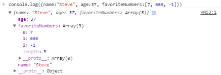

Part 4: A brief introduction to TypeScript
==========================================

I said this tutorial was designed for people who had used JavaScript but not TypeScript so I'll mostly just talk about the main differences between the two.

### Types in TypeScript ###

TypeScript code is translated into normal JavaScript (which has no static type system), and alongside that process, type checking is performed in order to discover *type errors* - mistakes you've made that have something to do with types. (Of course, occasionally, it also complains about things you did intentionally that nevertheless broke the rules of TypeScript).

Types can be attached to variables with a colon (:) in their definition, like so:

    let z: number = 26;

However you often don't have to *write down* the type. For example, if you write

    let z = 26;

TypeScript *infers* that z is a number. So if you write

~~~ts
let z = 26;
z = "Not a number";
~~~

You'll get an error on the second line. TypeScript originally did adopt a loophole though: any variable can be `null` or `undefined`:

~~~ts
z = null;      // Allowed!
z = undefined; // Allowed!
~~~

If you're new to JavaScript, you're probably wondering what `null` and `undefined` are (or [why they are two different things](https://stackoverflow.com/questions/5076944/what-is-the-difference-between-null-and-undefined-in-javascript)) - well, I promised to tell you about _TypeScript_ and null/undefined are _JavaScript_ things. Ha! But I will say that personally I don't use `null` very much; I find convenient to use `undefined` consistently to avoid worrying about the distinction. `undefined` is the default value of new variables, and function parameters that were not provided by the caller, and it's the value you get if you read a property  that doesn't exist on an object. By contrast, JavaScript itself rarely uses `null` for any purpose, so it only appears if you use it in your code.)

Anyway, many people (including me) are of the opinion that allowing _any_ variable to be null/undefined was a bad idea, so TypeScript 2.0 [allows you to take away that permission](https://blog.mariusschulz.com/2016/09/27/typescript-2-0-non-nullable-types) with the `"strictNullChecks": true` compiler option in tsconfig.json. Instead you would write

    let z: number | null = 26;

if you **want** z to be potentially null (`|` means "or").

TypeScript has the ability to understand variables that can have multiple types. For example, here is some normal JavaScript code:

~~~js
var y;
//  Math.random() is a random number between 0 and 1
if (Math.random() < 0.5)
    y = "Why?";
else
    y = 25;
y = [y, y];
console.log(y); // print [25,25] or ["Why?","Why?"] in browser's console
~~~

This is allowed in TypeScript also, because `var y` (by itself) gives `y` a type of `any`, meaning anything. So we can assign any value or object or whatever to `y`. So we can certainly set it to a string or a number or an array of two things. `any` is a special type; it means "this value or variable should act like a JavaScript value or variable and, therefore, not give me any type errors."

I recommend the `"strict": true` compiler option, but in that mode TypeScript doesn't allow `var y`; it requires `var y: any` instead.

However, TypeScript allows us to be more specific by saying

    var y: string | number;

This means "variable y is a string or a number". If `y` is created this way, then the `if-else` part is allowed but the other part that says `y = [y, y]` is not allowed, because `[y, y]` is not a string and not a number either (it's an array of type `number[] | string[]`). This feature, in which a variable can have one of two (or more) types is called **union types** and it's often useful.

**Tip:** To help you learn TypeScript, it may help to [do experiments in the playground](http://www.typescriptlang.org/play/). 
 
To help you learn more about **JavaScript**, press F12 in Chrome, Firefox or Edge and look for the Console. In the console you can write JavaScript code, to find out what a small piece of JavaScript does and whether you are writing it correctly:

Since TypeScript is just JavaScript with types, you can use the console to help you learn the part of TypeScript that doesn't have types. In your TypeScript file you can call `console.log(something)` to print things in the browser's console. In some browsers, `log` can display complex objects, for example, try writing `console.log({name:"Steve", age:37, favoriteNumbers:[7, 666, -1]})`:

The help button (F1) isn't able to look up API documentation, so I recommend searching [Mozilla Developer Network](https://developer.mozilla.org/en-US/docs/Web) for information about built-in JavaScript APIs and browser APIs. Meanwhile, Node.js APIs are documented on [nodejs.org](https://nodejs.org/api/).

### Classes ###

As you know, classes are bundles of functions and variables that can be instantiated into multiple objects. Functions inside classes can refer to other functions and variables inside the class, but in JavaScript and TypeScript you must use the prefix `this.`. A typical JavaScript class might look like this:

~~~js
class Box {
  constructor(width, height) {                  // initializer
    this.width = width;
    this.height = height;
  }
  get area() { return this.width*this.height; } // getter function
  setSquare(side) {                             // normal function
    // set the Box's width and height to side, representing a square
    this.width = this.height = side;
  }
  static ZeroSize() { return new Box(0, 0); }   // static (class-level) function
}

var big = new Box(1920, 1080);
var mini = new Box(19.2, 10.8);
console.log(`The big box is ${big.area/mini.area} times larger than the minibox`);
console.log(`The area of the zero-size box is ${Box.ZeroSize().area}.`);
~~~

JavaScript is a little picky: when you create a function outside a class it has the word `function` in front of it, but when you create a function inside a `class`, it is _not allowed_ to have the word `function` in front of it. I don't know, maybe that's because functions inside classes are called "methods" instead of functions. Functions and methods are the same thing, except that methods in classes have access to `this` - a reference to the current object. Except for `static` methods. `static` methods are called on the `class` (e.g. `Box.ZeroSize` in this example) so they do not have "current object".

The console output is

    The big box is 10000 times larger than the small one
    The zero-size box has an area of 0.

Unlike JavaScript, TypeScript classes allow variable declarations, such as `width` and `height` in this example:

~~~ts
class Box {
  width: number;
  height: number;
  constructor(width: number, height: number) {
    this.width = width;
    this.height = height;
  }
  get area() { return this.width*this.height; }
  setSquare(side: number) {
    this.width = this.height = side;
  }
  static ZeroSize() { return new Box(0, 0); }
}
~~~

For convenience, TypeScript lets you define a constructor and the variables it initializes at the same time. So instead of 

~~~ts
  width: number;
  height: number;
  constructor(width: number, height: number) {
    this.width = width;
    this.height = height;
  }
~~~

you can simply write

~~~ts
  constructor(public width: number, public height: number) {}
~~~

For any C# developers reading this, it works exactly like my [LeMP system](http://ecsharp.net/lemp/) for C#!

Unlike JavaScript, TypeScript has `private` (and `protected`) variables and functions which are inaccessible outside the class:

~~~ts
class PrivateBox {
  constructor(private width: number, private height: number) {}
  area() { return this.width * this.height; }
}
let x = new PrivateBox(4, 5);
console.log(x.area()); // OK
console.log(x.width); // ERROR: 'width' is private and only 
                      // accessible within class 'PrivateBox'.
~~~

`private` variables allow you to clearly mark parts of a class as "internal", things that users of the class should not modify, read, or even think about.

### Interfaces ###

Interfaces are a way of describing "shapes" of objects. Interfaces in TypeScript work like interfaces in the Go programming language, not like interfaces in Java and C# - and that's a good thing. Here's an example:

~~~ts
interface IBox {
    readonly width: number;
    readonly height: number;
}
interface IArea {
    readonly area: number;
}
~~~

`IBox` refers to any class that has a `width` and `height` property that are readable numbers, while `IArea` refers to anything with a readable `area` property. The `Box` class satisfies both of these requirements (the `get area()` function counts as a property, because it is called without `()` parentheses), and so I could write

~~~ts
let a: IBox = new Box(10,100);  // OK
let b: IArea = new Box(10,100); // OK
~~~

`readonly` means we can read, but not change:

~~~ts
console.log(`The box is ${a.width} by ${a.height}.`); // OK
a.width = 2; // ERR: Cannot assign to 'width' because it is a constant or a read-only property.
~~~

Strangely, TypeScript does not require `readonly` for interface compatibility. For example, TypeScript accepts this code even though it doesn't work:

~~~ts
interface IArea {
  area: number; // area is not readonly, so it can be changed
}

let ia: IArea = new Box(10,100);
ia.area = 5; // Accepted by TypeScript, but causes a runtime error
~~~

I think of it as a bug in TypeScript.

TypeScript also has a concept of optional parts of an interface:

~~~ts
interface Person {
    readonly name: string;
    readonly age: number;
    readonly spouse?: Person;
}
~~~

For example we can write `let p: Person = {name:'John Doe', age:37}`. Since `p` is a `Person`, we can later refer to `p.spouse`, which is equal to `undefined` in this case but could be a `Person` if a different object were assigned to it that has a `spouse`. However, you are not allowed to write `p = {name:'Chad', age:19, spouse:'Jennifer'}` with the wrong data type for `spouse` (TypeScript explains that *"Type `string` is not assignable to type `Person | undefined`."*)

### Structural types ###

In some other programming languages, every type has a name, such as `string` or `double` or `Component`. In TypeScript, many types do have names but, more fundamentally, most types are defined by their structure. In other words, the type's name, if it even has one, is not important to the type system. Here's an example where variables have a structural type:

~~~js
var book1 = { title: "Adventures of Tom Sawyer",       year:1876 };
var book2 = { title: "Adventures of Huckleberry Finn", year:1884 };
~~~

If you hover your mouse over `book1` in VS Code, its type is described as `{ title: string; year: number; }`. This is a "structural" type: a type defined entirely by the fact that it has a property called `title` which is a `string`, and another property called `year` which is a `number`. Thus `book1` and `book2` have the same type and you can assign one to the other, or to a different book.

~~~js
book1 = book2; // allowed
book2 = { year: 1995, title: "Vertical Run" }; // allowed
~~~

Generally speaking you can assign a value with "more stuff" to a variable whose type includes "less stuff", but not the other way around:

~~~ts
var book3 = { title: "The Duplicate", author: "William Sleator", year:1988 };
var book4 = { title: "The Boy Who Reversed Himself" };
book1 = book3; // allowed
bool1 = bool4; /* NOT allowed. Here is the error message:
  Type '{ title: string; }' is not assignable to type '{ title: string;
  year: number; }'. Property 'year' is missing in type '{ title: string; }'.
*/
~~~

In addition if we have an interface like this:

~~~ts
interface Book {
    title: string;
    author?: string;
    year: number;
}
~~~

Then we can assign any `Book` value to any of these book variables (except `book3`, because the `author` is required in `book3` and `Book` might not contain an author), and we can assign any of the book variables to a new variable of type `Book` (except `book4`, of course).

Clearly, structural types are fantastic. This is obvious after you spend a few years using languages without them. For example, imagine if two people, Alfred and Barbara, write different modules `A` and `B`. They both deal with points using X-Y coordinates. So each module contains a `Point` interface:

~~~js
interface Point {
    x: number;
    y: number;
}
~~~

Many languages use "nominal" types instead of structural types, and in these languages `A.Point` is considered to be a completely different type than `B.Point` even though they are identical. So any points produced by `A` cannot be used by `B` and vice versa. This is frustrating and stupid, so please take a moment to celebrate with me the wonder of TypeScript's structural typing.

Structural types can be written either with semicolons or commas, e.g. `{ x: number, y: number }` and `{ x: number; y: number; }` are the same.

### Type aliases ###

The `type` statement creates a new name for a type; for example after writing

    type num = number;

You can use `num` as a synonym for `number`. `type` similar to `interface` since you can write something like this...

~~~ts
type Point = {
    x: number;
    y: number;
}
~~~

...instead of `interface Point {...}`. However, only interfaces support _inheritance_; for example I can create a new interface that is _like_ `Point` but also has a new member `z`, like this:

~~~ts
interface Point3D extends Point {
    z: number;
}
~~~

You can't do inheritance with `type` (however if `Point` was defined with `type`, you are still allowed to extend it with an `interface`).

### Function types ###

In JavaScript you can pass functions to other functions, like this:

~~~js
function doubler(x) { return x*2; }
function squarer(x) { return x*x; }
function experimenter(func)
{
  console.log(`When I send 5 to my function, ${func(5)} comes out.`);
}
experimenter(doubler);
experimenter(squarer);
~~~

Output:

    When I send 5 to my function, 10 comes out.
    When I send 5 to my function, 25 comes out.

In TypeScript you normally need to write down the types of function arguments, which means you need to know how to express the type of `func`. As you can see here, its type should be something like `(param: number) => number`:

~~~ts
function doubler(x: number) { return x*2; }
function squarer(x: number) { return x*x; }
function experimenter(func: (param: number) => number)
{
  console.log(`When I send 5 to my function, ${func(5)} comes out.`);
}
experimenter(doubler);
experimenter(squarer);
~~~

TypeScript requires you to give a _name_ to the parameter of `func`, but it doesn't matter what that name is. I could have called it `x`, or `Wednesday`, or `myFavoriteSwearWord` and it would have made no difference whatsoever. But don't even think of calling it `asshat`. Don't you dare think about the hat and the.... no! Just don't. Stop.

In JavaScript, everything inside an object is a "property" (a kind of variable), and that includes functions. As a consequence, these two interfaces mean the same thing:

~~~ts
interface Thing1 {
  func: (param: number) => number;
}
interface Thing2 {
  func(param: number): number;
}
~~~

And so this code is allowed:

~~~ts
class Thing {
  func(x: number) { return x * x * x; }
}
let t1: Thing1 = new Thing();
let t2: Thing2 = t1;
~~~

Does it seem weird to you that TypeScript requires `:` before the return type of a "normal" function but it requires `=>` before the return type of a function _variable_? Anyway, that's the way it is.

### Generics (and Dates, and stuff) ###

Let's say I write a function that ensures a value is an array, like this:

~~~ts
function asArray(v: any): any[] {
  // return v if it is an array, otherwise return [v]
  return (Array.isArray(v) ? v : [v]);
}
~~~

The `asArray` function _works_, but it loses type information. For example what if this function calls it?

~~~ts
/** Prints one or more dates to the console */
function printDates(dates: Date|Date[]) {
  for (let date of asArray(dates)) {
      // SUPER BUGGY!
      var year = date.getYear();
      var month = date.getMonth() + 1;
      var day = date.getDay();
      console.log(`${year}/${month}/${day}`);
  }
}
~~~

The TypeScript compiler accepts this code, but it has two bugs. The code correctly added `1` to the month (because `getMonth()` returns 0 for January and 11 for December), but the code for getting the Year and Day are both wrong. Since `asArray` returns `any[]`, however, type checking and IntelliSense, which could have caught these bugs, is disabled on `date`. These bugs could have been avoided if `asArray` were _generic_:

~~~ts
function asArray<T>(v: T | T[]): T[] {
  return Array.isArray(v) ? v : [v];
}
~~~

This version of `asArray` does the same thing, but it has a _type parameter_, which I have decided to call `T`, to enable enhanced type checking. The type parameter can be any type, so it is similar to `any`, but it enables the function to describe the _relationship_ between the parameter `v` and the return value. Specifically, it says that `v` and the return value have, well, similar types. When you call `asArray`, the TypeScript compiler finds a value of `T` that allows the call to make sense. For example, if you call `asArray(42)` then the compiler chooses `T=number` because it is possible to use 42 as an argument to `asArray(v: number|number[]): number[]`. After choosing `T=number`, TypeScript realizes that `asArray` returns an array of numbers.

In `printDates` we called `asArray(dates)` and the compiler figures out that `T=Date` works best in that situation. After choosing `T=Date`, TypeScript realizes that `asArray` returns an array of `Date`. Therefore, the variable `date` has type `Date`, and then it finds the first bug: `date.getYear` does not exist! Well, actually it does exist, but it has been deprecated due to its strange behavior (it returns the number of years since 1900, i.e. 118 in 2018). Instead you should call `getFullYear`.

TypeScript itself doesn't notice the second bug, but when you type `date.getDay`, VS Code will inform you in a little popup box that this function "Gets the day of the week, using local time". The day of the _week_? You have **got** to be kidding me!

Thanks to generics and VS Code, we fix our code to call `date.getDate` instead, which of course does **not** return the date without a time attached to it (like any sensible person would think) but rather the _day of the current month_. Unlike the month, the day does **not** start counting from zero.

~~~ts
/** Prints one or more dates to the console */
function printDates(dates: Date|Date[]) {
  for (let date of asArray(dates)) {
      var year = date.getFullYear();
      var month = date.getMonth() + 1;
      var day = date.getDate();
      console.log(`${year}/${month}/${day}`);
  }
}
~~~

Meanwhile, you start to wonder whether `Date` has more pitfalls you should be aware of and which moron designed the `Date` class in the first place. The answers are "yes" and "Brendan Eich slavishly copied Date's horrible design from [Java 1.0](http://web.mit.edu/java_v1.0.2/www/javadoc/java.util.Date.html)".

One good thing about `Date`s is that they are normally stored in UTC (universal time zone a.k.a. GMT). This means that if the user changes the time zone on their computer, the `Date` objects in your program continue to represent the same _point in time_, but the string returned by `.toString()` changes. Usually this is what you want, especially in JavaScript where you might have client and server code running in different time zones.

An advanced example of generics appears in my [simplertime module](https://www.npmjs.com/package/simplertime). In this case I had a `timeToString` function that accepted a list of formatting options like this:

~~~ts
export interface TimeFormatOptions {
  /** If true, a 24-hour clock is used and AM/PM is hidden */
  use24hourTime?: boolean;
  /** Whether to include seconds in the output (null causes seconds
   *  to be shown only if seconds or milliseconds are nonzero) */
  showSeconds?: boolean|null;
  ...
}

export function timeToString(time: Date|number, opt?: TimeFormatOptions): string {
  ...
}
~~~

The `export` keyword is used for sharing code to other source files. For example you can import `timeToString` in your own code using `import {timeToString} from 'simplertime'` (after installing with `npm i simplertime` of course). If you want to import things from a different file in the **same folder**, add a `./` prefix on the filename, e.g. `import * as stuff from './mystuff'`.

Generics can also be used on classes and interfaces. For example, JavaScript has a `Set` type for holding an unordered collection of values. We might use it like this:

~~~js
var primes = new Set([2, 3, 5, 7]);
for (var i = 0; i < 10; i++)
  console.log(`Is the number ${i} prime? ${primes.has(i)}`);
~~~

In TypeScript, though, `Set` has a type parameter, `Set<T>`, meaning that all items in the set have type `T`. In this code TypeScript infers that `T=number`, so if you write `primes.add("hello!")` you'll get a Type Error. If you actually **want** to create a set that can hold both strings and numbers, you can do it like this:

~~~js
var primes = new Set<string|number>([2, 3, 5, 7]);
~~~

You can also create your own generic types. For example, I created a [B+ Tree](https://en.wikipedia.org/wiki/B%2B_tree) data structure called [`BTree<K, V>`](https://github.com/qwertie/btree-typescript), which is a collection of key-value pairs, sorted by key, that supports fast cloning. It has two type parameters, `K` (a key) and `V` (a value) and its definition looks roughly like this (function bodies have been omitted because I just want to show you how a generic class looks):

~~~js
// Type parameters can have default values,
// so `var t: BTree` means `var t: BTree<any,any>`
export class BTree<K=any, V=any>
{
  // Root node (key-value pairs are stored in here)
  private _root: BNode<K, V>;
  // Total number of items in the collection
  _size: number = 0;
  // Maximum number of items in a single node
  _maxNodeSize: number;
  // This function must return less-than-0 if a<b and above-zero if a>b
  _compare: (a:K, b:K) => number;
    
  public constructor(entries?: [K,V][], 
                     compare?: (a: K, b: K) => number, 
                     maxNodeSize?: number) { ... }
  
  get size() { return this._size; }
  clear() { ... }
  get(key: K): V | undefined { ... }
  set(key: K, value: V, overwrite?: boolean): boolean { ... }
  has(key: K): boolean { ... }
  delete(key: K) { ... }
  /** Quickly clones the tree by marking the root node as shared. 
   *  Both copies remain editable. When you modify either copy, any
   *  nodes that are shared (or potentially shared) between the two
   *  copies are cloned so that the changes do not affect other copies.
   *  This is known as copy-on-write behavior, or "lazy copying". */
  clone(): BTree<K,V> { ... }

  ...
}
~~~

### Footnote ###

Remember how there is an error when you write this?

    let z = 26;
    z = "Zed";

The error message sounds a bit strange:

    Type '"Zed"' is not assignable to type 'number'

In order to actually *understand* this error message, it is necessary to understand that TypeScript has an ability to treat values as types. `"Zed"` is a `string`, of course, but it's more than that; it has _another type at the same time_, a type called `"Zed"`. The concept of a value or variable having two different types simultaneously is called *intersection types*. We can even create a variable with this type:

    let zed: string & "Zed" = "Zed";

Now we have now created a completely useless variable called `zed` whose type is both `string` and `"Zed"` (`&` means "and"). We can set this variable to `"Zed"`, but nothing else:

    zed = "Zed"; // OK
    zed = "ZED"; // Error: Type '"ZED"' is not assignable to type '"Zed"'.

Technically we can set `zed` to `null` and `undefined` but luckily with `"strictNullChecks": true` we can close that loophole so that this variable will never be anything except "Zed". Thank God for that, is all I can say.

Confused? Well, never mind, hopefully you'll get it later. Honestly, it doesn't matter right now.

Here's another puzzle for you: what's the difference between the types `number[]` and `[number]`? The first is an array of numbers; the second is an array that contains only one element, which is a number. 

Similarly `[string,number]` denotes an array of length 2 with the first element being a string and the second being a number. In addition, the array has a property `length: 2`, i.e. its _type_ is `2`, not just `number`. These fixed-length arrays are called tuple types. To learn about more interesting features of TypeScript's type system, see [Advanced Types](https://www.typescriptlang.org/docs/handbook/advanced-types.html).

### Advanced generics ###

So, remember the `simplertime` module I was talking about? It also exports a `defaultTimeFormat` object which holds default values for the `timeToString` formatting options. I wanted to define a special function which would allow me to write things like `get(options, 'use24hourTime')` to retrieve the value of `options.use24hourTime` if it exists and `defaultTimeFormat.use24hourTime` if it does not exist. In many languages it is impossible to write a function like that, but it is possible in "dynamic" languages such JavaScript. Here's how the `get` function would look like in JavaScript:

~~~js
function get(opt, name) {
  if (opt === undefined || opt[name] === undefined)
    return defaultTimeFormat[name]
  return opt[name];
}
~~~

In JavaScript and TypeScript, `thing.property` can be written as `thing["property"]` instead and if the property does not exist, the result is `undefined`. But in the square-bracket version we can use a _variable_, so that the question "which property are we using?" can be answered by code located elsewhere.

Translating this to TypeScript is possible with a feature called `keyof`, but it's _very_ tricky. Here is the translation:

~~~ts
function get<K extends keyof TimeFormatOptions>(
         opt: TimeFormatOptions|undefined, name: K): TimeFormatOptions[K] {
  if (opt === undefined || opt[name] === undefined)
    return defaultTimeFormat[name]
  return opt[name];
}
~~~

Here, the type variable `K` has a _constraint_ attached to it, `K extends keyof TimeFormatOptions`. Here's how it works:

1. `keyof X` turns the properties of `X` into a union type of the names of the properties. For example, given the `Book` interface from earlier, `keyof Book` means `"title" | "author" | "age"`. Likewise `keyof TimeFormatOptions` is any of the strings in `TimeFormatOptions`.
2. The "extends" constraint, `X extends Y`, means that "X must be Y, or a subtype of Y". For example `X extends Object` means that `X` must be some kind of `Object`, which means it can be an array or a `Date` or even a function, all of which are considered to be Objects, but it can't be a `string` or a `number` or a `boolean`. Similarly `X extends Point` means that `X` is `Point` or a _more specific_ type than `Point`, such as `Point3D`.
3. What would `B extends keyof Book` mean? It would mean that `B` is a _subtype_ of `"title" | "author" | "age"`. And remember that we are talking about _types_ here, not _values_. The string literal `"title"` has the _value_ `"title"` but it also has the _type_ `"title"`, which is a different concept. The _type_ is handled by the TypeScript type system, the _value_ is handled by the JavaScript. The `"title"` _type_ no longer exists when the program is running but the `"title"` _value_ still does. Now, `B` can be assigned to types like `"title"` or `"title" | "age"`, because every value of type `"title" | "age"` (or "title") can be assigned to a variable of type `keyof Book`. However `B` cannot be `string`, because some strings are not "title", "author" or "age".
3. Similarly, `K` is constrained to have a subtype of `keyof TimeFormatOptions`, such as `"use24hourTime"`.
4. The type `X[Y]` means "the type of the Y property of X, where Y is a number or string literal". For example, the _type_ `Book["author"]` is `string | undefined`.

Putting this all together, when I write `get(options, 'use24hourTime')`, the compiler decides that `K='use24hourTime'`. Therefore, the `name` parameter has type `"use24hourTime"` and the return type is `TimeFormatOptions["use24hourTime"]`, which means `boolean | undefined`.

### Holes in the type system ###

Since TypeScript is built on top of JavaScript, it accepts some flaws in its type system for various reasons. Earlier we saw one of these flaws, the fact that this code is legal:

~~~ts
class Box {
  constructor(public width: number, public height: number) {}
  get area() { return this.width*this.height; }
}

interface IArea {
  area: number; // area is not readonly
}

let ia: IArea = new Box(10,100);
ia.area = 5; // Accepted by TypeScript, but causes a runtime error
~~~

Here are some other interesting loopholes:

### You can assign a derived class to a base class

A `Date` is a kind of `Object` so naturally you can write

    var d: Object = new Date();

So it makes sense that we can also assign this `D` interface to this `O` interface, right? Well, no, not really:

~~~js
interface D { date: Date }
interface O { date: Object }
var de: D = { date: new Date() };    // okay...
var oh: O = de;                      // makes sense...
oh.date = { date: {wait:"what?"} }   // wait, what?
~~~

TypeScript now believes `de.date` is a `Date` when it is actually an `Object`.

#### You can assign [A,B] to (A|B)[]

It makes sense that an array of two items, an `A` followed by a `B`, is also a an array of `A|B`, right? Actually, no, not really:

~~~js
var array1: [number,string] = [5,"five"];
var array2: (number|string)[] = array1;   // makes sense...
array2[0] = "string!";                    // wait, what?
~~~

TypeScript now believes `array1[0]` is a `number` when it is actually a `string`. This is an example of a more general problem, that arrays are covariant but.

### Arrays? There be dragons.

In the recommended `strict` mode, you can't put `null` or `undefined` in arrays of numbers...

~~~js
var a = [1,2,3];
a[3] = undefined; // Type 'undefined' is not assignable to type 'number'
~~~

So that means when we get a value from an array of numbers, it's a number, right? Actually, no, not really:

~~~js
var array = [1,2,3];
var n = array[4];
~~~

TypeScript now believes `n` is a `number` when it is actually `undefined`.

A more obvious hole is that you can allocate a sized array of numbers... with no numbers in it:

~~~js
var array = new Array<number>(2); // array of two "numbers"
var n:number = array[0];
~~~

### Function parameters are bivariant when overriding

Unlike other languages with static typing, TypeScript allows overriding with covariant parameters. "Covariant parameter" means that as the class gets more specific (A to B), the parameter also gets more specific (Object to Date):

~~~js
class A {
    method(value: Object) { }
}

class B extends A {
    method(value: Date) { console.log(value.getFullYear()); }
}

var a:A = new B();
a.method({}); // Calls B.method, which has a runtime error
~~~

This is unsafe, but oddly it is allowed. In contrast, it is (relatively) safe to override with _contravariant_ parameters, like this:

~~~js
class A {
    method(value: Date) { }
}
class B extends A {
    method(value: Object) { console.log(value instanceof Date); }
}
~~~

Covariant return types are also safe:

~~~js
class A {
    method(): Object { return {} }
}
class B extends A {
    method(): Date { return new Date(); }
}
~~~

TypeScript rightly rejects contravariant return types:

~~~js
class A {
    method(): Date { return new Date(); }
}
class B extends A {
    // Property 'method' in type 'B' is not assignable to the same property in base type 'A'.
    //   Type '() => Object' is not assignable to type '() => Date'
    //     Type 'Object' is not assignable to type 'Date'
    method(): Object { return {} }
}
~~~

### Lessons

To avoid these holes, you need to

- Not treat an object as a "baser" type (e.g. don't treat `D` as an `O`) unless you are sure that the baser type won't be modified in a way that could violate the type system.
- Don't cast an array to a "baser" type (e.g. don't treat `D[]` as `O[]`, or `[A,B]` as `(A|B)[]`) unless you are sure that the baser type won't be modified in a way that could violate the type system.
- Be careful not to leave any "holes" with undefined values in your arrays.
- Be careful not to use out-of-bounds array indexes.
- Not override a base-class method with covariant parameters.

TypeScript actually had [more](https://github.com/Microsoft/TypeScript/issues/9765) [holes](https://github.com/Microsoft/TypeScript/issues/3410#issuecomment-111646030) in the past, which are now fixed.

JSX
---

React introduced the concept of JSX code. Or maybe [Hyperscript](https://github.com/hyperhype/hyperscript) introduced it and React copied the idea soon afterward. In any case, JSX *looks* like HTML/XML code, but you are not making DOM elements, you're making plain-old JavaScript objects, which we call a "virtual DOM". For example `` actually means `React.createElement("img", { src: imageUrl })` in a .jsx or .tsx file.

If JSX is a React thing, why am I talking about it in the TypeScript section? Because support for JSX is built into the TypeScript compiler.

JSX can be used in the same places as normal expressions: you can pass JSX code to a function...

    ReactDOM.render(<h1>I'm JSX code!</h1>, document.body);

you can store it in a variable...

    let variable = <h1>I'm JSX code!</h1>;

and you can return it from a function...

    return <h1>I'm JSX code!</h1>;

Because `<h1>I'm JSX code!</h1>` really just means `React.createElement("h1", null, "I'm JSX code!")`.

It is important whether a JSX tag starts with a capital letters; it is translated to TypeScript (or JavaScript) differently if it does. For example,

- `
` means `React.createElement('div', {"class":"foo"})`, but
- `
` means `React.createElement(Div, {"class":"foo"})` (without quotes around `Div`).

Tips for using JSX:

- JSX is XML-like, so all tags must be closed: write ` `, not ` `.
- JSX only supports string attributes and JavaScript expressions. When writing numeric attributes in TypeScript, use `<input type="number" min={0} max={100}/>`, because `max=100` is a syntax error and `max="100"` is a type error.
- In React/Preact, you can use an array of elements in any location where a list of children are expected. For example, instead of `return 
Ann Bob Cam
`, you can write `let x = [ , 'Bob',  ]; return 
Ann{x}Cam
`. This has the same effect because React/Preact "flattens" arrays in the child list.

At the top of the file, the `@jsx` pragma can control the "factory" function that is called to translate JSX elements. For example if you use `/** @jsx h */` then `<b>this</b>` translates to `h('b', null, "this")` instead of `React.createElement('b', null, "this")`. Some Preact apps use this pragma (`h` is the preact function to create elements), but you won't need to use it in this tutorial (`createElement` is a synonym for `h`). Also, in tsconfig.json you can get the same effect with `"jsxFactory": "h"` in the `compilerOptions`.

See also
--------

- [TypeScript evolution](https://blog.mariusschulz.com/series/typescript-evolution): excellent documentation of the newer TypeScript features

Next
----

See [Part 5](tutorial-5.md) to start learning about React!
