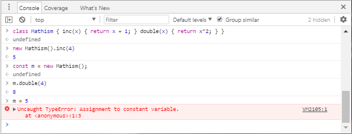

Part 4: A brief introduction to TypeScript
------------------------------------------

I said this tutorial was designed for people who had used JavaScript but not TypeScript so I'll mostly just talk about the main differences between the two.

### Types in TypeScript ###

TypeScript code is translated into normal JavaScript (which has no static type system), and in the process type checking is performed, in order to discover *type errors* - mistakes you've made that have something to do with types. (Of course, occasionally, it also complains about things you did intentionally that nevertheless broke the rules of TypeScript).

Types can be attached to variables with a colon (:) in their definition, like so:

    let z: number = 26;

However you often don't have to *write down* the type. For example, if you write

    let z = 26;

TypeScript *infers* that z is a number. So if you write

~~~ts
let z = 26;
z = "Not a number";
~~~

You'll get an error on the second line. TypeScript originally did adopt a loophole though: any variable can be `null` or `undefined`:

~~~ts
notNumber = null;      // Allowed!
notNumber = undefined; // Allowed!
~~~

If you're new to JavaScript, you're probably wondering what `null` and `undefined` are (or why they are two different things) - that's a hard question that I can dodge because I promised to tell you about _TypeScript_ and null/undefined are _JavaScript_ things. Ha! Anyway, many people (including me) are of the opinion that allowing _any_ variable to be null/undefined was a terrible idea, so TypeScript 2.0 [allows you to take away that permission](https://blog.mariusschulz.com/2016/09/27/typescript-2-0-non-nullable-types) with the `"strictNullChecks": true` compiler option in tsconfig.json. Instead you would write

    let z: number | null = 26;

if you want z to be potentially null (`|` means "or").

TypeScript has the ability to understand variables that can have multiple types. For example, here is some normal JavaScript code:

~~~js
var y;
//  Math.random() is a random number between 0 and 1
if (Math.random() < 0.5)
    y = "Why?";
else
    y = 25;
y = [y, y];
console.log(y); // print [25,25] or ["Why?","Why?"] in browser's console
~~~

This is allowed in TypeScript also, because `var y` (by itself) gives `y` a type of `any`, meaning anything. So we can assign any value or object or whatever to `y`. So we can certainly set it to a string or a number or an array of two things. `any` is a special type; it means "this value or variable should act like a JavaScript value or variable and, therefore, not give me any type errors."

However, TypeScript allows us to be more specific by saying

    var y: string | number;

This means "variable y is a string or a number". If `y` is created this way, then the `if-else` part is allowed but the other part that says `y = [y, y]` is not allowed, because `[y, y]` is not a string and not a number either (it's an array of type `number[] | string[]`). This feature, in which a variable can have one of two (or more) types is called **union types** and it's often useful.

**Tip:** To help you learn about **JavaScript**, press F12 in Chrome or Firefox and look for the Console. In the console you can write JavaScript code, to find out what a small piece of JavaScript does and whether you are writing code correctly:

Since TypeScript is just JavaScript with types, you can use the console to help you learn the part of TypeScript that doesn't have types. In your TypeScript file you can call `console.log(something)` to print things in the browser's console. In some browsers, `log` can display complex objects, for example, try writing `console.log({name:"Steve", age:37, favoriteNumbers:[7, 666, -1]})`:

### Classes ###

As you know, classes are bundles of functions and variables that can be instantiated into multiple objects; functions inside classes must refer to other functions and variables inside the class with the prefix `this.`. A typical JavaScript class might look like this:

~~~js
class Box {
  constructor(width, height) {                  // initializer
    this.width = width;
    this.height = height;
  }
  get area() { return this.width*this.height; } // getter function
  setSquare(side) {                             // normal function
    // set the Box's width and height both equal to side
    this.width = this.height = side;
  }
  static ZeroSize() { return new Box(0, 0); }   // static (class-level) function
}

var big = new Box(1920, 1080);
var small = new Box(19.2, 10.8);
console.log(`The big box is ${big.area/small.area} times larger than the small one`);
console.log(`The area of the zero-size box is ${Box.ZeroSize().area}.`);
~~~

JavaScript is a little picky: when you create a function outside a class it has the word `function` in front of it, but when you create a function inside a `class`, it is _not allowed_ to have the word `function` in front of it. I don't know, maybe that's because functions inside classes are called "methods" instead of functions. They are really the same thing except that functions inside classes have access to `this` - a reference to the current object.

The console output is

    The big box is 10000 times larger than the small one
    The zero-size box has an area of 0.

TypeScript is the same except that you can declare variables in addition to functions and getters:

~~~ts
class Box {
  width: number;
  height: number;
  constructor(width, height) {
    this.width = width;
    this.height = height;
  }
  get area() { return this.width*this.height; }
  setSquare(side: number) {
    this.width = this.height = side;
  }
  static ZeroSize() { return new Box(0, 0); }
}
~~~

For convenience, TypeScript allows you to define a constructor and the variables it initializes at the same time. So instead of 

~~~ts
  width: number;
  height: number;
  constructor(width, height) {
    this.width = width;
    this.height = height;
  }
~~~

you can simply write

~~~ts
  constructor(public width: number, public height: number) {}
~~~

For any C# developers reading this, it works exactly like my [LeMP system](http://ecsharp.net/lemp/) for C#!

Unlike JavaScript, TypeScript has `private` (and `protected`) variables and functions which are inaccessible outside the class:

~~~ts
class PrivateBox {
  constructor(private width: number, private height: number) {}
  area() { return this.width * this.height; }
}
let x = new PrivateBox(4, 5);
console.log(x.area()); // OK
console.log(x.width); // ERROR: 'width' is private and only accessible within class 'PrivateBox'.
~~~

`private` variables allow you to clearly mark parts of a class as "internal", things that users of the class should not modify, read, or even think about.

### Interfaces ###

Interfaces are a way of referring to "shapes" of objects. Interfaces in TypeScript work like interfaces in Go, not like interfaces in Java and C# - and that's a good thing. Here's an example:

~~~ts
interface IBox {
    readonly width: number;
    readonly height: number;
}
interface IArea {
    readonly area: number;
}
~~~

`IBox` refers to any class that has a `width` and `height` property that are readable numbers, while `IArea` refers to anything with a readable `area` property. The `Box` class satisfies both of these requirements (the `get area()` function counts as a property, because it is called without `()` parentheses), and so I could write

~~~ts
let a: IBox = new Box(10,100);  // OK
let b: IArea = new Box(10,100); // OK
~~~

`readonly` means we can read, but not change:

~~~ts
console.log(`The box is ${a.width} by ${a.height}.`); // OK
a.width = 2; // ERR: Cannot assign to 'width' because it is a constant or a read-only property.
~~~

Strangely, TypeScript doesn't require `readonly` for interface compatibility. For example, TypeScript accepts this code even though it doesn't work:

~~~ts
interface IArea {
  area: number; // area is not readonly, so it can be changed
}

let iarea: IArea = new Box(10,100);
iarea.area = 5; // Accepted by TypeScript, but causes a runtime error
~~~

I think of it as a bug in TypeScript. TypeScript also has a concept of optional parts of an interface:

~~~ts
interface Person {
    readonly name: string;
    readonly age: number;
    readonly spouse?: Person;
}
~~~

For example we can write `let p: Person = {name:'John Doe', age:37}`. Since `p` is a `Person`, we can later refer to `p.spouse`, which is equal to `undefined` in this case but could be a `Person` if a different object were assigned to it that has a `spouse`. However, you are not allowed to write `p = {name:'Chad', age:19, spouse:'Jennifer'}` with the wrong data type for `spouse` (TypeScript explains that *"Type 'string' is not assignable to type 'Person | undefined'."*)

### Function types ###

In JavaScript you can pass functions to other functions, like this:

~~~js
function doubler(x) { return x*2; }
function squarer(x) { return x*x; }
function experimenter(func)
{
  console.log(`When I send 5 to my function, ${func(5)} comes out.`);
}
experimenter(doubler);
experimenter(squarer);
~~~

Output:

    When I send 5 to my function, 10 comes out.
    When I send 5 to my function, 25 comes out.

In TypeScript you normally need to write down the types of function arguments, which means you need to know how to express the type of `func`. As you can see here, its type should be something like `(param: number) => number`:

~~~ts
function doubler(x: number) { return x*2; }
function squarer(x: number) { return x*x; }
function experimenter(func: (param: number) => number)
{
  console.log(`When I send 5 to my function, ${func(5)} comes out.`);
}
experimenter(doubler);
experimenter(squarer);
~~~

TypeScript requires you to give a _name_ to the parameter of `func`, but it doesn't matter what that name is. I could have called it `x`, or `Wednesday`, or `myFavoriteSwearWord` and it wouldn't have made any difference.

In JavaScript, everything inside an object is a "property" (a kind of variable), and that includes functions. As a consequence, these two interfaces mean the same thing:

~~~ts
interface Thing1 {
  func: (param: number) => number;
}
interface Thing2 {
  func(param: number): number;
}
~~~

And so this code is allowed:

~~~ts
class Thing {
  func(x: number) { return x * x * x; }
}
let t1: Thing1 = new Thing();
let t2: Thing2 = t1;
~~~

### Footnote ###

Remember how there is an error when you write this?

    let z = 26;
    z = "Zed";

The error message sounds a bit strange:

    Type '"Zed"' is not assignable to type 'number'

In order to actually *understand* this error message, it is necessary to understand that TypeScript has an ability to treat values as types. `"Zed"` is a `string`, of course, but it's more than that; it has _another type at the same time_, a type called `"Zed"`. The concept of a value or variable having two different types simultaneously is called *intersection types*. We can even create a variable with this type:

    let zed: string & "Zed" = "Zed";

Now we have now created a completely useless variable called `zed` whose type is both `string` and `"Zed"` (`&` means "and"). We can set this variable to `"Zed"`, but nothing else:

    zed = "Zed"; // OK
    zed = "ZED"; // Error: Type '"ZED"' is not assignable to type '"Zed"'.

Technically we can set `zed` to `null` and `undefined` but luckily with `"strictNullChecks": true` we can close that loophole so that this variable will never be anything except "Zed". Thank God for that, is all I can say.

Confused? Well, never mind, hopefully you'll get it later. Honestly, it doesn't matter right now.

The thing is, 

JSX
---

React introduced the concept of JSX code. It *looks* like HTML/XML code, but you are not making DOM elements, you're making plain-old JavaScript objects, which we call a "virtual DOM". For example `` actually means `React.createElement("img", { src: imageUrl })` in a .jsx or .tsx file.

If it's a React thing, why am I talking about it in the TypeScript section? Because support for JSX is built into the TypeScript compiler.

JSX can be used in the same places as normal expressions: you can pass JSX code to a function...

    ReactDOM.render(<h1>I'm JSX code!</h1>, document.body);

you can store it in a variable...

    let variable = <h1>I'm JSX code!</h1>

and you can return it from a function...

    return <h1>I'm JSX code!</h1>;

Because `<h1>I'm JSX code!</h1>` really just means `React.createElement("h1", null, "I'm JSX code!")`.

Next
----

See [Part 5](tutorial-5.md) to learn about React programming.
