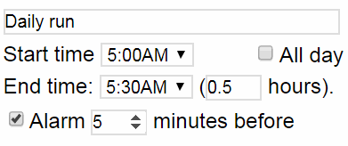
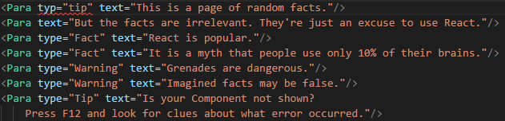
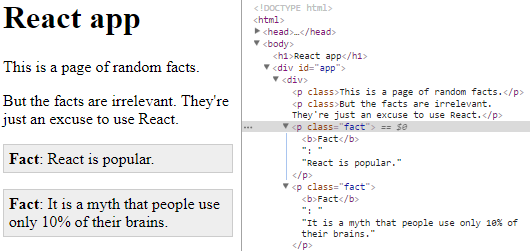

Part 5: Understanding React
===========================

Part 1: Why do people like React?
---------------------------------

There have been many different ways of synchronizing an internal collection of data (the Model) with the graphical user interface (GUI or UI) that a user sees (also known as the View). In my early days as a programmer, I would often synchronize manually. So if I had a textbox (which, in HTML, is called `<input type="text">`) I would have to install an event handler to find out when the textbox changed, and I would write some code to copy its value into an internal variable. When the internal variable changed, I would have to manually call a function whose job is to copy the model into the view. (In simple cases, I could skip this work and do nothing until the user clicks "OK" or "Submit".)

Often this wasn't difficult, but it became harder as the user interface got more sophisticated. If GUI widgets (a.k.a. Windows controls, Android views, etc.) depend on each other in complicated ways, or if multiple parts of the user interface showed the same, changing, information (which had to stay synchronized), it became challenging to handle every situation that could possibly arise. As complexity rose, bugs tended to appear in the user interface, and the code tended to be be messy and non-modular.

The most common technique to make it easier to create user interfaces is probably [data binding](https://en.wikipedia.org/wiki/Data_binding), but by itself it doesn't solve the problem entirely (and it still requires manually initiating synchronization from model to view). So beyond that, people typically use [MVC](https://en.wikipedia.org/wiki/Model%E2%80%93view%E2%80%93controller) or [MVVM](https://en.wikipedia.org/wiki/Model%E2%80%93view%E2%80%93viewmodel). These techniques, I have found, don't make the code *easier* to write, because they tend to involve a bunch of boilerplate and duplication of concepts in different places. However, these techniques make the code cleaner, better-encapsulated, more scalable and easier to maintain (especially in large programs). Beyond that, there are other ideas floating around to automate the synchronization between model and view, such as [C#'s Update Controls](http://updatecontrols.net/cs/index.html).

React is none of these things. Instead, React resembles the idea of immediate-mode user interfaces that was [invented/described by Casey Muratori in 2005](https://www.youtube.com/watch?v=Z1qyvQsjK5Y). The idea of immediate-mode user interfaces is to *eliminate* the problem of synchronizing the View and Model by "eliminating" the View. 

What do I mean by that? Obviously the view must exist in some sense, since you can see it on the screen. In the old world of desktop development, GUI widgets are objects that belong to the operating system. They have a long life cycle: you create a window filled with widgets, and those widgets exist as long as the user can see them.

In immediate-mode UIs, often used in game programming, widgets only have the *illusion* of permanence. In reality they exist long enough to be drawn on the screen, and checked against user input, and then they are deleted. A game with an immediate-mode UI will regenerate and redraw the entire UI from the underlying data model about 60 times per second. In this style of UI, there is no need to "synchronize" the UI with the model; the model is what "really" exists and the view is merely a temporary index that points into the model.

So in immediate mode, if there is a text box with the word "Hello" in it, it's directly showing the value `"Hello"` from the underlying model, and if there is a blinking cursor after the 'H', there must be another variable in the model (or in an extra data structure separate from the model) with the value `1` to represent the current location of the cursor. Although this style of programming requires you to include view-related state (such as the cursor position) alongside/inside your model, it is arguably an easier way of UI programming because it eliminates almost every bug and challenge with synchronizing the model with the view.

Let's consider the example of a user interface for a calendar entry in a Calendar app. 

We want a user interface for defining both all-day events and normal short events, so

- When "All day" is checked or unchecked, all the other "time range" widgets need to be hidden or shown.
- We want the user to be able to tell us either an end time or the length of the event, so the two parts of the third row must stay in sync somehow.
- Finally, if the user chooses a time from the fourth row then the "Alarm" checkbox should be checked automatically.

We might have a model with these data members:

~~~ts
class CalendarEvent {
  name:         string;
  allDay:       boolean;
  startTime:    Date;
  endTime:      Date;
  alarmMinutes: number;
}
~~~

In traditional user interface code, you would respond to a change in the "All day" checkbox or the `allDay` flag by somehow causing the "time range" widgets to be shown or hidden. The code that causes this change might be an event handler in the view, or, if you are using the MVVM pattern, it would be an event generated by the model; either way, a signal is sent **manually**.

By contrast, in immediate mode, we simply write code to create the view (associated somehow with a  model). When the view is changed by the user, the view changes the model, but it doesn't synchronize different parts of itself: there is no code to show or hide things. Likewise, in the model, there is no code to generate "events".

However, immediate mode is *fundamentally not* how a web browser works. A web browser "owns" all the user interface elements on the screen. Unless you are drawing *everything* on a `<canvas>` element, it is not practical to directly simulate immediate mode because it would be highly inefficient to destroy and recreate the entire [DOM](https://en.wikipedia.org/wiki/Document_Object_Model) frequently.

The innovation of React is that it simulates the advantage of immediate-mode UIs in a non-immediate-mode environment. This could be slow if it were done naïvely, but React speeds up the process by figuring out how to change the DOM as little as possible; it changes only parts of the DOM that are different now.

As a side effect of *not* changing elements that have not changed, React eliminates the main disadvantage of immediate-mode UIs: you **don't** have to keep track of standard view state such as the cursor position. For example, if a user types "Daily run" into a textbox, which causes "Daily run" to be saved into the model, then React will render a new user interface tree. As long as the new tree still includes a textbox that says "Daily run", React will not change the existing textbox, and therefore the cursor position in the textbox will remain unchanged.

Example #0: Hello, world!
-------------------------

These examples in this tutorial can use the same HTML file, such as this one:

~~~html
<!DOCTYPE html>
<html>
<head>
  <title>App</title>
  <meta charset="utf-8"/>
</head>
<body>
  <h1>React app</h1>
  

  <!-- This line requires Parcel -->
</body>
</html>
~~~

Let's start with a "Hello" component, just to learn what a React component looks like:

~~~ts
import * as React from 'react';
import * as ReactDOM from 'react-dom';

class App extends React.Component {
  render() {
      return <h2>Hello!!</h2>;
  }
}

ReactDOM.render(<App/>, document.getElementById("app"));
~~~

This code just puts **Hello!!** on the screen. It illustrates how you typically write a React program: 

1. Import `'react'` and `'react-dom'`. 
2. Write a class that `extends React.Component` and contains a `render()` function. 
3. Call `ReactDOM.render` to draw the component on the screen.

`document.getElementById` is a function built into all web browsers; it is used to find an element that has a particular `id` attribute. In this case it returns the element represented by `

` in our HTML code.

If you use F12 in your web browser to find out the final element tree of the page, it is very simple:

~~~html

<h2>Hello!!</h2>

~~~

Now let's learn about "properties" (props). Properties are data given to a component from its container (or from the `render` call):

~~~tsx
// (After this example, I will omit the import commands which are always the same)
import * as ReactDOM from 'react-dom';
import * as React from 'react';

class App extends React.Component<{message: string}> {
  render() {
      return <h2>{this.props.message}</h2>;
  }
}

ReactDOM.render(<App message="Hello, world!"/>, 
                document.getElementById("app"));
~~~

The part that says `React.Component<{message:string}>` indicates that `React.Component` has a single type parameter, which is `{message:string}`. The first type parameter of `React.Component` controls the type of `this.props`. Therefore, the type of `this.props` is `{message:string}`. What does that mean? It means that `this.props` contains a single property called `message`, and it is a `string`.

This is a bit unusual. In some other programming languages, every type has a name, such as `string` or `double` or `Component`. In TypeScript, many types do have names (e.g. `React.Component` is a type name) but, more fundamentally, most types are defined by their structure... even if they do have a name. `{message:string}` is an example of a "structural" type: it is a type defined entirely by the fact that it has a property called `message` which is a `string`.

When you are writing the JSX code to create a React component, properties are written like XML attributes, so in this case the attribute `message="Hello, world!"` sets `this.props.message` to the string `"Hello, world!"`.

Example #1: Random facts
------------------------

Now let's make a bigger page, something with not one but **two** props! It will look like this:

We'll need some CSS to style it, so we'll use an `app.css` file with this style code:

~~~css
.fact, .warning, .tip {
    padding: 0.3em;
}
.fact { 
    background-color: #eee;
    border: 1px solid #ccc;
}
.warning { 
    background-color: #fcc;
    border: 1px solid #f88;
}
.tip { 
    background-color: #ffc;
    border: 1px solid #cc4;
}
~~~

I assume you've learned about CSS already so I won't explain this part. We will also need to import that css into our html file, by adding a `<link>` element to the `<head>` of our `index.html` file:

~~~html
  <link rel="stylesheet" href="app.css">
~~~

You don't actually have to follow all these instructions, by the way. You can just download the completed examples from the [learn-react repository](https://github.com/qwertie/learn-react):

1. Click the "Clone or download" button and choose "Download ZIP" on that page.
2. Unzip the master.zip file that you downloaded
3. Go into the `react-examples` folder inside the unzipped folder
4. Go into `1-RandomFacts` subfolder 
5. Run `run.cmd` to serve the example from Parcel.
6. Visit `127.0.0.1:1234` or whatever address Parcel says the server is using.

Now that our CSS is set up, here is the React code that will generate the page:

~~~tsx
class Para extends React.Component<{type?: string, text: string}> {
  render() {
    // Create a list of ReactNodes which will be the children of a 
 element.
    let children: React.ReactNode[] = [ this.props.text ];
    // Find out if type contains a capital letter.
    let type = this.props.type || '';
    if (type !== type.toLowerCase()) {
      // It has a capital letter, so include it before the text, in bold.
      children.unshift(': ');
      children.unshift(<b>{type}</b>);
    }
    return 
{children}
;
  }
}

ReactDOM.render(
  

    <Para type="tip" text="This is a page of random facts."/>
    <Para text="But the facts are irrelevant. They're just an excuse to use React."/>
    <Para type="Fact" text="React is popular."/>
    <Para type="Fact" text="It is a myth that people use only 10% of their brains."/>
    <Para type="Warning" text="Grenades are dangerous."/>
    <Para type="Warning" text="Imagined facts may be false."/>
    <Para type="Tip" text="Is your Component not shown?
        Press F12 and look for clues about what error occurred."/>
  
,
  document.getElementById('app'));
~~~

This time, `this.props` has this type: `{type?: string, text: string}`. So both of the properties have type `string`, and the question mark indicates that `type` is optional. I would also draw your attention to the `ReactDOM.render` call. Our page contains multiple paragraphs, but `ReactDOM.render` can only accept one element to render. Therefore, we must enclose all the `Para`s in one `div` element, and then we give the `div` element to `ReactDOM.render`.

The `Para` component has some relatively complicated logic. The `type` property sets the `class` of each element (as you can see in the first paragraph), but if you use any capital letters in the `type` then it also becomes part of the text of the paragraph (as you can see in most of the other paragraphs).

TypeScript code tends to be a little longer than normal JavaScript code because it contains some type annotations. In this program there are two type annotations. One of them is the type parameter on `React.Component<{type?: string, text: string}>`; in normal JavaScript you would simply write `React.Component` because the entire concept of type parameters does not exist in JavaScript. We receive benefits from this longer code, because VS Code will tell us immediately when we have used a component incorrectly...

...and it can also tell us what properties are available on any component (although unfortunately it incorrectly shows a lot of extra things on the list... hopefully that will be fixed in the future):

The other type annotation appears on the `children` variable; TypeScript needs me to write this:

    let children: React.ReactNode[] = [ this.props.text ];

but plain JavaScript must be written without the type annotation as

    let children = [ this.props.text ];

The type annotation is important because `this.props.text` is a string. If the type annotation is left out, TypeScript will infer that `children` is an array of strings (`string[]`), but it actually needs to be an array of React nodes. A string is one of the legal kinds of React nodes, but you can see that our code sometimes adds a `<b>` element to the array, which is definitely not a `string` (it's a `JSX.Element`):

~~~tsx
      children.unshift(': ');
      children.unshift(<b>{type}</b>);
~~~

Since TypeScript is based on JavaScript, it inherits all the strange names that JavaScript uses. Who would have guessed that `unshift` means "add something to the beginning of the array"? Anyway, if the `type` is `"Fact"` and `text` is `"React is popular"` then you can imagine that our `children` array will end up with these three items in it: 

~~~tsx
  [<b>Fact</b>, ": ", "React is popular"]
~~~

**Tip:** How did I figure out that `children` should have type `React.ReactNode[]`? Believe it or not, I'm actually a beginner at React (I enjoy writing tutorials as part of my learning process.) Well, I already knew that JSX translates into `React.createElement` which is a function that takes 3 arguments:

1. The type of element or Component to create
2. An object that contains some properties (or `null` if no properties)
3. A list of children.

Knowing this, I typed `React.createElement(` in VS Code, which causes it to tell me the types of the three arguments:

Surprisingly there seem to be 8 different versions of `createElement`, but all of them have the same type for their third argument: `React.ReactNode[]`. So that's the type I used for our `children` variable. I don't know why it says `...` in the pop-up box, but apparently those dots aren't important right now.

**Fun fact:** we're asking React to create two plain-text nodes in a row: one is `": "`, the other is `"React is popular"`. We can see them both in the Chrome debugger:

I just find that kind of interesting because in normal HTML, it's impossible to write two separate text nodes side-by-side like this. Only in the DOM can this funny situation exist.

Example #2: Bar graph
---------------------

You don't need a fancy graphics package to make a bar graph; some simple ordinary HTML can do the job:

Example #3: The button thing from Part 2
----------------------------------------

~~~tsx
class App extends React.Component<{greeting: string}, {count:number}> {
  constructor(props) {
    super(props);
    this.state = {count: 0};
  }
  render() {
      return (
          

              <h2>{this.props.greeting}</h2>
              <button onClick={() => this.setState({count: this.state.count+1})}>
                This button has been clicked {this.state.count} times.
              </button>
          
);
  }
}

ReactDOM.render(
  <App greeting="Hello, world!"/>,
  document.getElementById('app')
);
~~~

This example introduces the concept of state, which is required if the user can make changes to the data in the program. The state of a component can be changed 

Example #3: Calendar event editor
---------------------------------

Let's create a React-based editor for the `CalendarEvent` model above. Let's start by making an HTML mockup of the user interface, without React. The mockup could use this code:

~~~html
  <h1>Edit Calendar Entry</h1>
  

    
    
<input type="text" style="width:250px" value="Daily run">

    
<input type="checkbox">All day

    
Start time 
      <input type="text" list="times" style="width:70px" name="startTime">
      <datalist id="times">
        <option value="12:00am"><option value="12:30am">
        <option value="1:00am"><option value="1:30am">
        <option value="2:00am"><option value="2:30am">
        <option value="3:00am"><option value="3:30am">
        <option value="4:00am"><option value="4:30am">
        <option value="5:00am"><option value="5:30am">
        <option value="6:00am"><option value="6:30am">
        <option value="7:00am"><option value="7:30am">
        <option value="8:00am"><option value="8:30am">
        <option value="9:00am"><option value="9:30am">
        <option value="10:00am"><option value="10:30am">
        <option value="11:00am"><option value="11:30am">
        <option value="12:00pm"><option value="12:30pm">
        <option value="1:00pm"><option value="1:30pm">
        <option value="2:00pm"><option value="2:30pm">
        <option value="3:00pm"><option value="3:30pm">
        <option value="4:00pm"><option value="4:30pm">
        <option value="5:00pm"><option value="5:30pm">
        <option value="6:00pm"><option value="6:30pm">
        <option value="7:00pm"><option value="7:30pm">
        <option value="8:00pm"><option value="8:30pm">
        <option value="9:00pm"><option value="9:30pm">
        <option value="10:00pm"><option value="10:30pm">
        <option value="11:00pm"><option value="11:30pm">
      </datalist>
    

    
End time: 
      <input type="text" list="times" style="width:70px">
      (<input type="number" style="width:40px" value="0.5" step="0.25" min="0" max="24"> hours).

    
<input type="checkbox" checked>Alarm
       <input type="number" style="width:40px" value="5" min="0" max="720"> minutes before
    

  

~~~

Unfortunately the `datalist` element doesn't behave in a useful way (the dropdown list becomes useless once a time is selected) but it's a reasonable starting point.

*gasp*

Learn More
----------

Sorry, this article is not yet complete. I recommend reading [Thinking in React](https://reactjs.org/docs/thinking-in-react.html) or [some other tutorial](https://www.google.com.ph/search?q=react+tutorial).

Picky typing in JSX
-------------------

You may find that TypeScript is overly picky in JSX. For example, it accepts this code:

~~~ts
let test = 
Text
;
~~~

But it rejects this code:

~~~ts
let right = 'right';
let test = 
Text
;
~~~

Its complaint:

~~~
Type '{ style: { textAlign: string; }; }' is not assignable to type 'DetailedHTMLProps<HTMLAttributes<HTMLDivElement>, HTMLDivElement>'.
  Type '{ style: { textAlign: string; }; }' is not assignable to type 'HTMLAttributes<HTMLDivElement>'.
    Types of property 'style' are incompatible.
      Type '{ textAlign: string; }' is not assignable to type 'CSSProperties'.
        Types of property 'textAlign' are incompatible.
          Type 'string' is not assignable to type 'TextAlignProperty'.
~~~

Totally insane, right? And don't try fighting back with

~~~ts
let right = 'right';
let test = 
Text
;
~~~

TypeScript will just say "`Cannot find name 'TextAlignProperty'`. There are two workarounds. The easy one is "as any":

~~~ts
let right = 'right';
let test = 
Text
;
~~~

The CSS types are defined in *node_modules/csstype/index.d.ts* (a dependency of *node_modules/@types/react*). So another option is to import and use them like this:

~~~ts
import * as CSS from 'csstype'; // at top of file

let right: CSS.TextAlignProperty = 'right';
let test = 
Text
;
~~~
