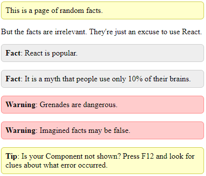
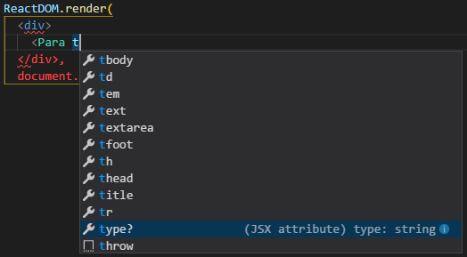

Part 5: React Basics
====================

The pain of UI design
---------------------

Many ways have been invented to synchronize an internal collection of off-screen data (the Model) with the graphical user interface (GUI or UI) that a user sees (also known as the View). In my early days as a programmer, I would often synchronize manually. Often if I had a textbox (which, in HTML, is called `<input type="text">`) I would have to install an event handler to find out when the textbox changed, and I would write some code to copy its value into an internal variable. When the internal variable changed, I would have to manually call a function to copy the model into the view. (In simple cases, I could skip this work and do nothing until the user clicks "OK" or "Submit".)

This wasn't too difficult, but it became harder as the user interface got more sophisticated. If GUI widgets (i.e. "elements" in HTML, "controls" in Windows, "views" in Android) depend on each other in complicated ways, or if multiple parts of the user interface showed the same, changing, information (which had to stay synchronized), it became challenging to handle every situation that could possibly arise. As complexity rose, bugs tended to appear in the user interface, and the code tended to be be messy and non-modular.

The difficulty comes from the variety of update operations that must be done as the model and view change over time. Imagine an on-screen listbox: when first created, the list is empty and needs code that will fill it based on the model. If an item is added or removed in the model, the item needs to be added or removed in the view also. Clearing the list and refilling it is the easiest approach, but it's inefficient, and perhaps the user interface won't have the correct scroll bar position afterward, or it might forget which item is currently selected. Now imagine there is a textbox showing a field from the currently selected list item. When you select a different item in the listbox, that textbox must be updated. If the user changes the text, the new text needs to be stored in the model and perhaps also in the listbox. Likewise if the text changes in the model, that new text needs to be shown in the textbox and perhaps also in the listbox. When no item is selected, the textbox should be hidden; when an item is selected, the textbox should be shown.

So although this is a simple example, it could still require a lot of code. One of the easiest ways invented to deal with this synchronization challenge has been [data binding](https://en.wikipedia.org/wiki/Data_binding), but by itself it doesn't solve the problem entirely (e.g. a data binding system typically cannot show and hide the text box for you). Beyond that, people typically use [MVC](https://en.wikipedia.org/wiki/Model%E2%80%93view%E2%80%93controller) or [MVVM](https://en.wikipedia.org/wiki/Model%E2%80%93view%E2%80%93viewmodel). These techniques, I have found, don't make the code *easier* to write, because they tend to involve a bunch of boilerplate and duplication of concepts in different places. However, these techniques make the code better-encapsulated, more scalable and easier to maintain (especially in large programs). Beyond that, there are other ideas floating around to automate the synchronization between model and view, such as [.NET's Update Controls](http://updatecontrols.net/cs/index.html).

React is none of these things.

React _somewhat_ resembles the idea of _immediate-mode user interfaces_ that was [invented/described by Casey Muratori in 2005](https://www.youtube.com/watch?v=Z1qyvQsjK5Y). The idea of immediate-mode user interfaces is to *eliminate* the problem of synchronizing the View and Model by "eliminating" the View. 

What do I mean by that? Obviously the view must exist in some sense, since you can see it on the screen. In the old world of desktop development, GUI widgets are objects that belong to the operating system. They have a long life cycle: you create a window filled with widgets, and those widgets exist as long as the user can see them.

In a simple immediate-mode UI, often used in game programming, widgets only have the *illusion* of permanance. In reality they exist long enough to be drawn on the screen, and checked against user input, and then they are deleted. A game with an immediate-mode UI might regenerate and redraw the entire UI from the underlying data model about 60 times per second. In this style of UI, there is no need to "synchronize" the UI with the model; the model is what "really" exists and the view is merely a temporary index into the model.

So in immediate mode, if there is a text box with the word "Hello" in it, it's directly showing the value `"Hello"` from the underlying model, and if there is a blinking cursor after the 'H', there must be another variable in the model (or in some extra memory area) with the value `1` to represent the current location of the cursor. Although this style of programming requires you to include view-related state (such as the cursor position) alongside/inside your model, it is arguably an easier way of UI programming because it eliminates almost every bug and challenge with synchronizing the model with the view.

Let's consider another example: a user interface for a calendar entry in a Calendar app. 

We want a user interface for defining both all-day events and normal short events, so

- When "All day" is checked or unchecked, all the other "time range" widgets need to be hidden or shown.
- We want the user to be able to tell us either an end time or the length of the event, so the two parts of the third row must stay in sync somehow.
- Finally, if the user chooses a time from the fourth row then the "Alarm" checkbox should be checked automatically.

We might have a model with these data members:

~~~ts
class CalendarEntry {
  eventName: string;
  allDay: boolean;
  startTime: Date;
  durationMinutes: number;
  alarmOn: boolean;
  alarmMinutes: number;
}
~~~

In traditional user interface code, you would respond to a change in the "All day" checkbox or the `allDay` flag by somehow causing the "time range" widgets to be shown or hidden. The code that causes this change might be an event handler in the view, or, if you are using the MVVM pattern, the model would generate an event, and then view would either have a binding from that flag to the visibility of the widgets, or a manual subscription to that event.

By contrast, in immediate mode, we simply write code to create the view (associated somehow with a model). When the user changes the view, the view changes the model, but it doesn't synchronize different parts of **itself**: there is no code to show or hide things, no code to copy text from a textbox into a listbox. The UI is regenerated with the same code that generated it the first time. Similarly, in the model, no code to generate "events" is needed. The view code is simple because it is declarative - it describes how the screen should look, not how to update it.

However, a web browser is inherently not an immediate-mode system (but rather a _retained-mode_ system), because the web browser (not the application) owns (retains) all the user interface elements on the screen and is responsible for drawing them.

Enter React
-----------

React isn't designed to simulate an immediate-mode UI. It wouldn't surprise me if React was invented by someone who had never even heard of an immediate mode UI.

But intentionally or not, React shares a major advantage with immediate mode: a _declarative approach_ to describing UIs. That is, you _declare_ how your UI should look based on the current state associated with it, instead of explaining how the UI should _change_ in response to _changes_ in state. Declarative programming requires less careful thought, is less prone to bugs, and if you're doing it correctly, should also require less code.

It doesn't actually work like an immediate-mode UI though. For one thing, in React a parent component can be updated without affecting its children (or siblings), and a child component can be updated without affecting its parent (or siblings). This makes React more scalable, but it means you are responsible for designing your UI in such a way that when something changes in one part of the UI, those changes propagate to related components. Another difference (and this is something I don't like), React is designed to embed state within the UI instead of storing it in a separate model. It is possible to store your model separately, though, and many developers do.

Example #0: Hello, world!
-------------------------

These examples in this tutorial can use the same HTML file, such as this one:

~~~html
<!DOCTYPE html>
<html>
<head>
  <title>App</title>
  <meta charset="utf-8"/>
</head>
<body>
  <h1>React app</h1>
  

  <!-- This line requires Parcel -->
</body>
</html>
~~~

Let's start with a "Hello" component, just to learn what a React component looks like:

~~~ts
import * as React from 'react';
import * as ReactDOM from 'react-dom';

class App extends React.Component {
  render() {
      return <h2>Hello!!</h2>;
  }
}

ReactDOM.render(<App/>, document.getElementById("app"));
~~~

This code just puts **Hello!!** on the screen. It illustrates how you typically write a React program: 

1. Import `'react'` and `'react-dom'`. 
2. Write a class that `extends React.Component` and contains a `render()` function. 
3. Call `ReactDOM.render` to draw the component on the screen.

React allows simple components like this to be written as functions instead:

~~~js
function App() { return <h2>Hello!!</h2>; }
~~~

`document.getElementById` is a function built into all web browsers; it is used to find an element that has a particular `id` attribute. In this case it returns the element represented by `

` in our HTML code.

If you use F12 in your web browser to find out the final element tree of the page, it is very simple:

~~~html

<h2>Hello!!</h2>

~~~

Now let's learn about "properties" (props). Properties are data given to a component from its container (or from the `render` call):

~~~tsx
// (After this example, I will omit the import commands which are always the same)
import * as ReactDOM from 'react-dom';
import * as React from 'react';

class App extends React.Component<{message: string}> {
  render() {
      return <h2>{this.props.message}</h2>;
  }
}

ReactDOM.render(<App message="Hello, world!"/>, 
                document.getElementById("app"));
~~~

The part that says `React.Component<{message:string}>` indicates that `React.Component` has a single type parameter, which is `{message:string}`. This type parameter controls the type of `this.props`. Therefore, the type of `this.props` is `{message:string}`. What does that mean? It means that `this.props` contains a single property called `message`, and it is a `string`.

This is a bit unusual. In some other programming languages, every type has a name, such as `string` or `double` or `Component`. In TypeScript, many types do have names (e.g. `React.Component` is a type name) but, more fundamentally, most types are defined by their structure (their name, if they have one, is not important to the type system). `{message:string}` is an example of a "structural" type: it is a type defined entirely by the fact that it has a property called `message` which is a `string`. It has no name, only structure.

When you are writing the JSX code to create a React component, properties are written like XML attributes, so in this case the attribute `message="Hello, world!"` sets `this.props.message` to the string `"Hello, world!"`.

Again, because this is a simple component (meaning that it has only a `render` function and no internal state), we could write it as a function instead:

~~~tsx
function App(props: {message:string}) {
  return <h2>{props.message}</h2>;
}
~~~

Example #1: Random facts
------------------------

Now let's make a bigger page, something with not one but **two** props! It will look like this:

We'll need some CSS to style it, so we'll use an `app.css` file with this style code:

~~~css
.fact, .warning, .tip {
    padding: 0.4em;
    border-radius: 0.3em;
}
.fact {
    background-color: #eee;
    border: 1px solid #ccc;
}
.warning { 
    background-color: #fcc;
    border: 1px solid #f88;
}
.tip { 
    background-color: #ffc;
    border: 1px solid #cc4;
}
~~~

I assume you've learned about CSS already so I won't explain this part. We will also need to import that css into our html file, by adding a `<link>` element to the `<head>` of our `index.html` file:

~~~html
  <link rel="stylesheet" href="app.css">
~~~

You don't actually have to follow all these instructions, by the way. You can just download the completed examples from the [learn-react repository](https://github.com/qwertie/learn-react):

1. Click the "Clone or download" button and choose "Download ZIP" on that page.
2. Unzip the master.zip file that you downloaded
3. Go into the `react-examples` folder inside the unzipped folder
4. Run `run-examples.cmd` to serve the example from Parcel.
6. Visit `127.0.0.1:1234` or whatever address Parcel says the server is using.

Now that our CSS is set up, here is the React code that will generate the page:

~~~tsx
class Para extends React.Component<{type?: string, text: string}> {
  render() {
    // Create a list of ReactNodes which will be the children of a 
 element.
    let children: React.ReactNode[] = [ this.props.text ];
    // Find out if type contains a capital letter.
    let type = this.props.type || '';
    if (type !== type.toLowerCase()) {
      // It has a capital letter, so include it before the text, in bold.
      children.unshift(': ');
      children.unshift(<b>{type}</b>);
    }
    return 
{children}
;
  }
}

ReactDOM.render(
  

    <Para type="tip" text="This is a page of random facts."/>
    <Para text="But the facts are irrelevant. They're just an excuse to use React."/>
    <Para type="Fact" text="React is popular."/>
    <Para type="Fact" text="It is a myth that people use only 10% of their brains."/>
    <Para type="Warning" text="Grenades are dangerous."/>
    <Para type="Warning" text="Imagined facts may be false."/>
    <Para type="Tip" text="Is your Component not shown?
        Press F12 and look for clues about what error occurred."/>
  
,
  document.getElementById('app'));
~~~

This time, `this.props` has this type: `{type?: string, text: string}`. So both of the properties have type `string`, and the question mark indicates that `type` is optional. I would also draw your attention to the `ReactDOM.render` call. Our page contains multiple paragraphs, but `ReactDOM.render` can only accept one element to render. Therefore, we must put all the `Para`s in one `div` element, and then we give the `div` element to `ReactDOM.render`.

A strange thing in the `
` element is the `className` attribute. You are not allowed to use the `class` attribute in React; you must use `className` instead (don't ask me why; Preact allows you to use `class` but React does not.)

The `Para` component has some relatively complicated logic. The `type` property sets the `class` of each element (as you can see in the first paragraph), but if you use any capital letters in the `type` then it also becomes part of the text of the paragraph (as you can see in most of the other paragraphs).

In normal JavaScript you would simply write `React.Component` (without type parameters) because the entire concept of type parameters does not exist in JavaScript. We receive benefits from this longer code, because VS Code will tell us with a red underline when we have used a component incorrectly...

...and it can also tell us what properties are available on any component (although unfortunately it incorrectly shows a lot of extra things on the list... hopefully that will be fixed in the future):

The other type annotation appears on the `children` variable; TypeScript needs me to write this:

    let children: React.ReactNode[] = [ this.props.text ];

but plain JavaScript must be written without the type annotation as

    let children = [ this.props.text ];

The type annotation is important because `this.props.text` is a string. If the type annotation is left out, TypeScript will infer that `children` is an array of strings (`string[]`), but it actually needs to be an array of React nodes. A string is one of the legal kinds of React nodes, but you can see that our code sometimes adds a `<b>` element to the array, which is definitely not a `string` (it's a `JSX.Element`):

~~~tsx
      children.unshift(': ');
      children.unshift(<b>{type}</b>);
~~~

Since TypeScript is based on JavaScript, it inherits all the strange names that JavaScript uses. Who would have guessed that `unshift` means "add something to the beginning of the array"? Anyway, if the `type` is `"Fact"` and `text` is `"React is popular"` then you can imagine that our `children` array will end up with these three items in it: 

~~~tsx
  [<b>Fact</b>, ": ", "React is popular"]
~~~

**Tip:** How did I figure out that `children` should have type `React.ReactNode[]`? Believe it or not, I'm actually a beginner at React (I enjoy writing tutorials as part of my learning process.) Well, I already knew that JSX translates into `React.createElement` which is a function that takes 3 arguments:

1. The type of element or Component to create
2. An object that contains some properties (or `null` if no properties)
3. A list of children.

Knowing this, I typed `React.createElement(` in VS Code, which causes it to tell me the types of the three arguments:

Surprisingly there seem to be 8 different versions of `createElement`, but all of them have the same type for their third argument: `React.ReactNode[]`. So that's the type I used for our `children` variable. I don't know why it says `...` in the pop-up box, but apparently those dots aren't important right now.

**Fun fact:** we're asking React to create two plain-text nodes in a row: one is `": "`, the other is `"React is popular"`. We can see them both in the Chrome debugger:

I find that interesting because in normal HTML, it's impossible to write two separate text nodes side-by-side like this. The DOM allows it but HTML does not, and so if you convert the DOM to HTML, the two text nodes are merged into one.

### Exercise for the reader ###

This is another "simple" component. Rewrite it as a function.

Example #2: The button thing from Part 2
----------------------------------------

~~~tsx
class App extends React.Component<{greeting: string}, {count:number}> {
  state = {count: 0};
  render() {
      return (
          

              <h2>{this.props.greeting}</h2>
              <button onClick={() => this.setState({count: this.state.count+1})}>
                This button has been clicked {this.state.count} times.
              </button>
          
);
  }
}

ReactDOM.render(
  <App greeting="Hello, world!"/>,
  document.getElementById('app')
);
~~~

This example introduces the concept of state, which is required if the user can make changes to the data in the program. The state of an object is the second type parameter to `React.Component`, in this case `{count:number}`, which means, the state is an object that has a `count` property of type `number`.

You are not _supposed_ to change the state of a component directly: don't write `this.state.count += 1`; instead, create an object describing which state variables to change, and pass that new object to `this.setState`, as demonstrated in the `onClick` handler in this example:

~~~js
    () => this.setState({count: this.state.count+1});
~~~

This convention is not enforced, though. The component still works if you mutate the state, as long as you call `setState` (or `forceUpdate`) to trigger a refresh:

~~~js
    () => {this.state.count += 1; this.setState({}); /* Naughty. */}
~~~

**Fun fact:** `setState` _plans_ a refresh rather than actually doing it, so this works even if the state changes afterward as in `this.setState({}); this.state.count += 1;`.

This example demonstrates very simple and basic state. As our program gets more complex, we will have to think more carefully about how we deal with state; more on that later.

Example #3: Bar graph
---------------------

You don't need a fancy graphics package just for a bar chart; HTML alone can do them pretty well, so that's what our next example will do.

This example introduces two new things:

1. Defining multiple components in one page. React programs usually contain many components so it's important to learn to break up your user interface into parts.
2. The representation of CSS styles in React.

First let's define a component that decides how to draw a single bar in the bar chart, including the label on the left-hand side. To make sure the left-hand side of each bar lines up with every other bar in the chart, we will draw the bar chart as a two-column table (left column: labels, right column: bars). Each label has an asterisk on it which is actually a link to the source of the data for that bar (I guess that's an unintuitive way to link to my sources, but a better idea didn't come to mind.) The size and color of each bar will be controlled by inline styles.

For example, here is the HTML of the first bar in the chart (`tr` = table row, `td` = table cell):

~~~html
<tr>
  <td>New fossil fuel plants<a href="https://www.iea.org/publications/wei2017/">*</a></td>
  <td>$117.2 billion</td>
</tr>
~~~

And here's the `Bar` component that generates the code:

~~~tsx
// Expected format of bar chart items and properties
interface BarItem {
  name: string;   // label for this bar
  value: number;  // value of the bar
  source: string; // citation/reference URL
}
interface BarProps {
  item: BarItem;
  maxValue: number; // value of largest bar
  maxWidth: number; // width in pixels of largest bar
  formatter(value:number): string; // converts BarItem.value to a string
}

class Bar extends React.Component<BarProps,{color:string}>
{
  state = { color: this.randomColor() };
  render() {  
    const width = this.props.item.value / this.props.maxValue * this.props.maxWidth;

    const style = { display: 'inline-block', width: width,
               backgroundColor: this.state.color, color: '#ffffff', 
               textAlign: 'right', padding: '10px 5px 10px 0' };
    const formatted = (this.props.formatter || (x => x))(this.props.item.value);

    // If the bar isn't very wide, write value on the right side of the bar 
    if (this.props.item.value * 2 < this.props.maxValue)
      var bar = <td>
             this.setState({ color: this.randomColor() })}>
              {'\u00A0' /* &nbsp; causes bar to have the correct height*/}
            {" "+formatted}
          </td>;
    else
      // Otherwise, write the bar's value inside the bar
      var bar = <td>
             this.setState({ color: this.randomColor() })}>
              {formatted}
            
          </td>;
    return (
        <tr>
          <td>{this.props.item.name}<a href={this.props.item.source}>*</a></td>
          {bar}
        </tr>);
  }
  randomColor() {
    // Choose an appropriate color for the bar
    return '#' + (Math.random() * 900000 + 100000 | 0).toString();
  }
}
~~~

As you can see, the _data_ for a bar is in the `BarItem` interface and the _props_ for a bar is `BarProps`. Another point of interest is the state, which holds the bar color. If you click on a bar it will change color.

You can also see that React supports inline styles in an interesting way: instead of writing CSS code, you create a JavaScript object that _resembles_ CSS code. The name of the styles must be camelCased (e.g. `text-align` becomes `textAlign`) and if numbers are used as sizes, React assumes they are measured in pixels.

Perhaps some would argue that the left side (label) and right side (bar) should be two separate components, but that's an argument for another day.

A `BarChart` will consist of a series of `Bars` in a table:

~~~tsx
interface BarChartProps {
  title: string;       // title shown above the bars (second column)
  data: BarItem[];     // data items to show
  maxBarWidth: number; // width in pixels of largest bar
  formatter(value:number): string; // converts BarItem.value to a string
}

class BarChart extends React.Component<BarChartProps,{}> {
  render() {
    const maxValue = this.props.data
          .map(item => item.value)
          .reduce((x,y) => Math.max(x,y), 0);
    return (
      <table style={ {borderSpacing:0} }>
        <thead><tr>
          <th></th><th>{this.props.title}</th>
        </tr></thead>
        <tbody>
          {this.props.data.map(item => 
            <Bar item={item} maxValue={maxValue} key={item.name}
                 maxWidth={this.props.maxBarWidth}
                 formatter={this.props.formatter} />)}
        </tbody>
      </table>);
  }
}
~~~

Originally my `<table>` didn't have `<thead>` or `<tbody>` elements. It worked perfectly, but React complained about the lack of `<tbody>` in the browser console, so I changed the code. React also complained that *'Each child in an array or iterator should have a unique "key" prop.'*, so I added a `key` property to Bar; the reason for `key` properties is [discussed in the React documentation](https://reactjs.org/docs/lists-and-keys.html#keys).

Finally we need to define the data (a `BarItem[]` array) and call `ReactDOM.render`:

~~~tsx
var graphData = [
  //{ name: 'Oil market revenue', value: 1700, source: 'http://www.visualcapitalist.com/size-oil-market/' },
  { name: 'New fossil fuel plants', value: 117.2, source: 'https://www.iea.org/publications/wei2017/' },
  { name: 'New solar plants', value: 114, source:  'http://fs-unep-centre.org/sites/default/files/publications/globaltrendsinrenewableenergyinvestment2017.pdf' },
  { name: 'New wind plants', value: 112, source: 'http://fs-unep-centre.org/sites/default/files/publications/globaltrendsinrenewableenergyinvestment2017.pdf' },
  { name: 'New nuclear plants', value: 26.3, source: 'https://www.iea.org/publications/wei2017/' },
  { name: 'New geothermal', value: 3, source: 'http://fs-unep-centre.org/sites/default/files/publications/globaltrendsinrenewableenergyinvestment2017.pdf' },
  { name: 'New hydro', value: 3, source: 'http://fs-unep-centre.org/sites/default/files/publications/globaltrendsinrenewableenergyinvestment2017.pdf' }
];

ReactDOM.render(
  

    <h3>Bar graph in ordinary HTML (generated by React, of course)</h3>
    <BarChart title="2017 Worldwide Spending (USD)" 
              data={graphData} maxBarWidth={500}
              formatter={value => '$'+value+' billion'}/>
  
,
  document.getElementById('app') 
)
~~~

One more thing, the chart looks better with a little CSS:

~~~css
body    { font-family: sans-serif; }
a       { text-decoration: none; }
a:hover { text-decoration: underline; }
~~~

#### Exercise for the reader: ####

- Edit the style: add a dividing line between the bars and their labels using a style of `border-left: 1px solid #888` in the second column. Remember how `border-left` becomes `borderLeft` in React?
- Change the bar chart to support negative numbers. You can do this by adding a third column dedicated to negative numbers between the two existing columns; you'll need to set the padding to zero between the second and third columns.

Example #4: Calendar event editor
---------------------------------

Let's create a React-based editor for the `CalendarEntry` model above. Let's start by making an HTML mockup of the user interface, without React. The mockup could use this code:

~~~html
  <h1>Edit Calendar Entry</h1>
  

    
    
<input type="text" style="width:250px" value="Daily run">

    
<input type="checkbox">All day

    
Start time 
      <input type="text" list="times" style="width:75px" name="startTime">
      <datalist id="times">
        <option value="12:00am"><option value="12:30am">
        <option value="1:00am"><option value="1:30am">
        <option value="2:00am"><option value="2:30am">
        <option value="3:00am"><option value="3:30am">
        <option value="4:00am"><option value="4:30am">
        <option value="5:00am"><option value="5:30am">
        <option value="6:00am"><option value="6:30am">
        <option value="7:00am"><option value="7:30am">
        <option value="8:00am"><option value="8:30am">
        <option value="9:00am"><option value="9:30am">
        <option value="10:00am"><option value="10:30am">
        <option value="11:00am"><option value="11:30am">
        <option value="12:00pm"><option value="12:30pm">
        <option value="1:00pm"><option value="1:30pm">
        <option value="2:00pm"><option value="2:30pm">
        <option value="3:00pm"><option value="3:30pm">
        <option value="4:00pm"><option value="4:30pm">
        <option value="5:00pm"><option value="5:30pm">
        <option value="6:00pm"><option value="6:30pm">
        <option value="7:00pm"><option value="7:30pm">
        <option value="8:00pm"><option value="8:30pm">
        <option value="9:00pm"><option value="9:30pm">
        <option value="10:00pm"><option value="10:30pm">
        <option value="11:00pm"><option value="11:30pm">
      </datalist>
    

    
End time: 
      <input type="text" list="times" style="width:75px">
      (<input type="number" style="width:40px" value="0.5" step="0.25" min="0" max="24"> hours).

    
<input type="checkbox" checked>Alarm
       <input type="number" style="width:40px" value="5" min="0" max="720"> minutes before
    

  

~~~

Unfortunately the `datalist` element doesn't behave in a useful way (the dropdown list becomes useless once a time is selected) but it's a reasonable starting point.

Since there are two time-of-day selectors, it's natural to put the code for that in its own component. But first, how will we represent time-of-day values? JavaScript has a `Date` type, but nothing to represent times of the day. We could, for instance, use a `number` to store the number of minutes since midnight. It's easy to print them as strings - given a number of minutes `n` between 0 and 3600, `${n/60|0}:${n%60}` gives us a time string in 24-hour format. But it's more challenging to convert user-provided strings like '4:07 am' into numbers like 167. 

JavaScript `Date`s are actually based on Unix Epoch time, storing the amount of time in milliseconds since midnight January 1, 1970 UTC. So it seems reasonable to represent the time as a time on January 1, 1970 UTC. But can we parse a user-provided `time` string with code like `new Date("1970-01-01 "+time)`? Unfortunately this may not work, because the date parsing behavior is [reportedly](https://developer.mozilla.org/en-US/docs/Web/JavaScript/Reference/Global_Objects/Date/parse) browser-specific unless it has a very specific format. A browser may not recognize "unofficial" formats at all, or it may choose UTC or local time arbitrarily. Chrome, for instance, recognizes `01 Jan 1970 0:00:00 UTC` as time zero, and `01 Jan 1970 12:00 am UTC` works too, but `01 Jan 1970 12:00am UTC` is not understood, and `01 Jan 1970 12:00 am` is interpreted as local time (and so in general is not time zero). Most importantly, this is browser-specific and therefore unreliable.

We could fix this with a third-party library, but I'm not happy with [Moment.js](https://momentjs.com/) or [Datejs](http://www.datejs.com/) as they are not small libraries but they _still_ don't understand time-of-day as a different concept from a date. So instead I wrote a function to parse time values (later I put it in its own [repo with tests](https://github.com/qwertie/simplertime)):

~~~tsx
function parseTime(t: string, localDate?: Date): Date|undefined {
  // ?: means non-capturing group and ?! is zero-width negative lookahead
  var time = t.match(/^\s*(\d\d?)(?::?(\d\d))?(?::(\d\d))?(?!\d)(\.\d+)?\s*(pm?|am?)?/i);
  if (time) {
    var hour = parseInt(time[1]), pm = (time[5] || ' ')[0].toUpperCase();
    var min = time[2] ? parseInt(time[2]) : 0;
    var sec = time[3] ? parseInt(time[3]) : 0;
    var ms = (time[4] ? parseFloat(time[4]) * 1000 : 0);
    if (pm !== ' ' && (hour == 0 || hour > 12) || hour > 24 || min >= 60 || sec >= 60)
      return undefined;
    if (pm === 'A' && hour === 12) hour = 0;
    if (pm === 'P' && hour !== 12) hour += 12;
    if (hour === 24) hour = 0;
    var date = new Date(localDate!==undefined ? localDate.valueOf() : 0);
    var set = (localDate!==undefined ? date.setHours : date.setUTCHours);
    set.call(date, hour, min, sec, ms);
    return date;
  }
  return undefined;
}
~~~

Having written that function, plus another function to convert a time to a string (`timeToStringUTC`), I adapted the mockup into a very simple time editor:

~~~tsx
class TimeSelector extends React.Component<{},{time?:Date}> {
  state = {time: undefined as (Date|undefined)};
  render() {
    let time = this.state.time;
    return (
      
        <input type="text" list="times" style={ {width:75} }
               onChange={ e => this.setState({time: parseTime(e.target.value)}) }value={(time ? timeToStringUTC(time, false) : "")}/>
        <datalist id="times">
          <option value="12:00am"/><option value="12:30am"/>
          <option value="1:00am"/><option value="1:30am"/>
          <option value="2:00am"/><option value="2:30am"/>
          <option value="3:00am"/><option value="3:30am"/>
          <option value="4:00am"/><option value="4:30am"/>
          <option value="5:00am"/><option value="5:30am"/>
          <option value="6:00am"/><option value="6:30am"/>
          <option value="7:00am"/><option value="7:30am"/>
          <option value="8:00am"/><option value="8:30am"/>
          <option value="9:00am"/><option value="9:30am"/>
          <option value="10:00am"/><option value="10:30am"/>
          <option value="11:00am"/><option value="11:30am"/>
          <option value="12:00pm"/><option value="12:30pm"/>
          <option value="1:00pm"/><option value="1:30pm"/>
          <option value="2:00pm"/><option value="2:30pm"/>
          <option value="3:00pm"/><option value="3:30pm"/>
          <option value="4:00pm"/><option value="4:30pm"/>
          <option value="5:00pm"/><option value="5:30pm"/>
          <option value="6:00pm"/><option value="6:30pm"/>
          <option value="7:00pm"/><option value="7:30pm"/>
          <option value="8:00pm"/><option value="8:30pm"/>
          <option value="9:00pm"/><option value="9:30pm"/>
          <option value="10:00pm"/><option value="10:30pm"/>
          <option value="11:00pm"/><option value="11:30pm"/>
        </datalist>
      );
  }
}
~~~

**Note**: There are two time fields, so the `datalist` will be duplicated in the DOM, but it still works. Also, we must set the initial `state` (or it will be `null` and cause a runtime error), but in doing so we need to set the `time` variable with a type annotation, `undefined as (Date|undefined)`, otherwise TypeScript will mistakenly believe that `time` has type `undefined` instead of `Date|undefined`. Interestingly this problem does not occur if you set `this.state` in the constructor (i.e. if your component has a constructor you can simply write `this.state = {}` inside it; in that case, `state` is inherited from `React.Component` with the correct type.)

**Sadly this code malfunctions**: it will not allow you to type a time such as `9:15` because the first character `9` is immediately interpreted (as `9:00 am`) which causes `render()` to be called again, so the text box is updated which screws up user input.

A classic solution to this problem is to avoid updating the internal state until the textbox loses keyboard focus (i.e. when the cursor stops blinking in the textbox). We can try this by changing `onChange` to `onBlur` ("on blur" is obscure JavaScript terminology that means "when the textbox loses focus".) 

Unfortunately, that doesn't work either; the text field becomes read-only! For some reason, React makes input elements read-only if you set the `value` without updating the state in `onChange`. This behavior would make sense if if `render()` were called on every keypress, but that's _not_ what happens. In fact, React installs its own `onChange` handler that reverts the textbox to its old value.

Removing the following line "solves" the problem by allowing only one-way data flow (from UI to `state`, not from `state` to UI):

~~~tsx
               value={(time ? timeToStringUTC(time, false) : "")}
~~~

Sometimes this might be enough, but in most apps we *need* data to flow from `state` to UI. The only workaround I have found is to create a **second** state variable to hold the user's potentially-invalid input. If the extra variable is called `timeInput`, the solution looks like this:

~~~tsx
class TimeSelector extends React.Component<{},{time?:Date,timeInput?:string}> {
  state = { timeInput: undefined as (string|undefined),
            time: undefined as (Date|undefined) };
  render() {
    let timeString = "";
    if (this.state.timeInput !== undefined)
        timeString = this.state.timeInput;
    else if (this.state.time !== undefined)
        timeString = timeToStringUTC(this.state.time, false);

    return (
      
        <input type="text" list="times" style={ {width:75} }
               value={timeString}
               onBlur={ e => this.setState({timeInput: undefined, 
                                           time: parseTime(e.target.value)}) }
               onChange={ e => this.setState({timeInput: e.target.value}) }/>
        <datalist id="times">
          (same as before)
        </datalist>
      );
  }
}
~~~

Just 8 additional lines of code... no biggie, right? If you ask me, one of the main purposes of a UI library (or any library) is to make your code simple, but I guess React's designers have different ideas.

Here is another component for the rest of the interface (note: the state management is incomplete here):

~~~tsx
interface CalendarEntry {
  eventName: string;
  allDay: boolean;
  startTime?: Date; // undefined when no valid start time is given
  durationMinutes: number;
  alarmOn: boolean;
  alarmMinutes: number;
}

class CalendarEntryEditor extends React.Component<{}, CalendarEntry> {
  state = {
    eventName: 'Daily run',
    allDay: false, 
    startTime: undefined,
    durationMinutes: 60,
    alarmOn: false,
    alarmMinutes: 5,
  }
  render() {
    var timeRangeElements: JSX.Element[] = [];
    if (!this.state.allDay) {
      timeRangeElements = [
        
Start time <TimeSelector/>
,
        
End time: <TimeSelector/>&nbsp;
          (<input type="number" style={ {width:50} } step={5} min={0} max={24*60}
           onChange={e => this.setState({durationMinutes:
                     e.target.valueAsNumber || this.state.durationMinutes})}
           value={this.state.durationMinutes}/> minutes).
        

      ];
    }
    return (
      

        
<input type="text" style={ {width:280} } 
                  onChange={e=>this.setState({eventName: e.target.value})}
                  value={this.state.eventName}/>

        

          <input type="checkbox" checked={this.state.allDay}
            onChange={e => this.setState({allDay: e.target.checked})}/>All day
        

        {timeRangeElements}
        

          <input type="checkbox" checked={this.state.alarmOn}
            onChange={e => this.setState({alarmOn: e.target.checked})}  />Alarm&nbsp;
          <input type="number" style={ {width:40} } min={0} max={720} 
            onChange={e => this.setState({alarmMinutes: 
                e.target.valueAsNumber || this.state.alarmMinutes, alarmOn:   true})}
              value={this.state.alarmMinutes}/> minutes before
        

      
);
  }
}

ReactDOM.render(<CalendarEntryEditor/>, document.getElementById("app"));
~~~

As you can see, the time range controls appear only if the `allDay` flag is not set, and editing the `alarmMinutes` box will caused the `alarmOn` checkbox to be checked. However, editing `durationMinutes` does not affect the end time or vice versa, because there is no mechanism in place to communicate between `TimeSelector` and `CalendarEntryEditor`. So, how should we set up this communication?

The classic way to do this is to "push" the state out of the child component to the parent, using two props: one to pass state from parent to child, and one to receive new state from the child. So `state.time` becomes `props.time` in order to receive a time from the parent, and `props.onTimeChange` is added in order to send a new time to the parent. Here is the code using this technique:

~~~tsx
interface TimeSelectorProps {
  time?: Date;
  onTimeChange: (time?:Date) => void;
}

class TimeSelector extends React.Component<TimeSelectorProps, 
                                           {timeInput?:string}>
{
  state = { timeInput: undefined as (string|undefined) };
  render() {
    let timeString = "";
    if (this.state.timeInput !== undefined)
        timeString = this.state.timeInput;
    else if (this.props.time !== undefined)
        timeString = timeToStringUTC(this.props.time, false);

    return (
      
        <input type="text" list="times" style={ {width:75} }
               value={timeString}
               onChange={ e => this.setState({timeInput: e.target.value}) }
               onBlur={ e => {
                 this.setState({timeInput: undefined});
                 this.props.onTimeChange(parseTime(e.target.value)); 
               } }/>
        <datalist id="times">
          (same as before)
        </datalist>
      );
  }
}

interface CalendarEntry {
  eventName: string;
  allDay: boolean;
  startTime?: Date; // Allow undefined when no valid start time is given
  durationMinutes: number;
  alarmOn: boolean;
  alarmMinutes: number;
}

class CalendarEntryEditor extends React.Component<{}, CalendarEntry> {
  state = {
    eventName: 'Daily run',
    allDay: false, 
    startTime: undefined,
    durationMinutes: 60,
    alarmOn: false,
    alarmMinutes: 5,
  }
  render() {
    var timeRangeElements: JSX.Element[] = [];
    if (!this.state.allDay) {
      let startTime = this.state.startTime;
      let endTime = startTime===undefined ? undefined :
          addMinutes(startTime, this.state.durationMinutes);
      console.log(endTime?timeToStringUTC(endTime,false):'undef');
      timeRangeElements = [
        
Start time:&nbsp;
          <TimeSelector time={this.state.startTime}
                onTimeChange={ time => this.setState({startTime: time}) }/>
,
        
End time:&nbsp;
          <TimeSelector time={endTime}
                onTimeChange={ time => this.setEndTime(time) }/>&nbsp;
          (<input type="number" style={ {width:50} } step={5} min={0} max={24*60}
             onChange={e => this.setState({durationMinutes: 
                     e.target.valueAsNumber || this.state.durationMinutes})}
             value={this.state.durationMinutes}/> minutes).
        

      ];
    }
    return (

      
<input type="text" style={ {width:280} } 
                onChange={e=>this.setState({eventName: e.target.value})}
                value={this.state.eventName}/>

      

        <input type="checkbox" checked={this.state.allDay}
          onChange={e => this.setState({allDay: e.target.checked})}/>All day
      

      {timeRangeElements}
      

        <input type="checkbox" checked={this.state.alarmOn}
          onChange={e => this.setState({alarmOn: e.target.checked})}/>Alarm&nbsp;
        <input type="number" style={ {width:40} } min={0} max={720} 
          onChange={e => this.setState({alarmMinutes: 
              e.target.valueAsNumber || this.state.alarmMinutes, alarmOn: true})}
            value={this.state.alarmMinutes}/> minutes before
      

    
);
  }
  setEndTime(time?: Date) {
    if (this.state.startTime && time) {
      // ! means "assume this value is not null or undefined". TypeScript
      // detects that `time` is not undefined based on control flow, because
      // clearly it's impossible for it to be undefined inside this "if" block.
      // But sometimes TypeScript doesn't figure it out for members of `state`,
      // in which case we need ! as a workaround.
      let dif = diffMinutes(time, this.state.startTime!);
      if (dif < 0)
          dif += 24*60;
      this.setState({durationMinutes: dif});
    }
  }
}

// Functions to add minutes to a Date or get the difference between two dates
function addMinutes(date: Date, minutes: number) {
  return new Date(date.valueOf() + minutes * 60000);
}
function diffMinutes(high: Date, low: Date) {
  return (high.valueOf() - low.valueOf()) / 60000;
}

ReactDOM.render(<CalendarEntryEditor/>, document.getElementById("app"));
~~~

Now that the `TimeSelector` talks to its parent, the start time, end time and number-of-minutes synchronize with each other automatically. Hooray!

But imagine, now, that this `CalendarEntryEditor` is embedded within a larger Calendar application. In that case, the editor will need to share the current `CalendarEntry` with an outer `CalendarApp` component that can save the `CalendarEntry` within the calendar and switch to a different `CalendarEntry` as the user clicks different parts of the calendar.

Once again, the `state` will need to become part of `props`, something like this:

~~~tsx
interface CalendarEntryEditorProps {
  entry: CalendarEntry;
  onEntryChange: (entry: CalendarEntry) => void;
}
~~~

That's all for now
------------------

I plan to add more material later but I hope this is enough to get you started. I also recommend reading [Thinking in React](https://reactjs.org/docs/thinking-in-react.html). For more complex user interfaces, I recommend [MobX](https://mobx.js.org/intro/overview.html).

Picky typing in JSX
-------------------

You may find that TypeScript is overly picky in JSX. For example, it accepts this code:

~~~ts
let test = 
Text
;
~~~

But it rejects this code:

~~~ts
let right = 'right';
let test = 
Text
;
~~~

Its complaint:

~~~
Type '{ style: { textAlign: string; }; }' is not assignable to type 'DetailedHTMLProps<HTMLAttributes<HTMLDivElement>, HTMLDivElement>'.
  Type '{ style: { textAlign: string; }; }' is not assignable to type 'HTMLAttributes<HTMLDivElement>'.
    Types of property 'style' are incompatible.
      Type '{ textAlign: string; }' is not assignable to type 'CSSProperties'.
        Types of property 'textAlign' are incompatible.
          Type 'string' is not assignable to type 'TextAlignProperty'.
~~~

Totally insane, right? And don't try fighting back with

~~~ts
let right = 'right';
let test = 
Text
;
~~~

TypeScript will just say "`Cannot find name 'TextAlignProperty'`.

When you have an error like this that refers to an external symbol, you can use the "Go to Symbol in Workspace" (Ctrl+T) command in VS Code to find the symbol. It turns out that `TextAlignProperty` is defined as `Globals | "center" | "end" | "justify" | "left" | "match-parent" | "right" | "start"` - essentially a list of possible strings. TypeScript only knows that `right` is a string, it doesn't keep track of _which_ string it is, hence the error.

There are two workarounds. The easy one is to say "as any":

~~~ts
let right = 'right';
let test = 
Text
;
~~~

The CSS types are defined in *node_modules/csstype/index.d.ts* (a dependency of *node_modules/@types/react*). So another option is to import and use one of those types, like this:

~~~ts
import * as CSS from 'csstype'; // at top of file

let right: CSS.TextAlignProperty = 'right';
let test = 
Text
;
~~~

Notes
-----

- `setState` doesn't replace the entire state. If your state has properties {a, b} and you write `setState({a: 'new_a'})` then `b` is left unchanged.
- I don't know why this is a thing, but you can call `setState` with a function, e.g. `this.setState(function(state, props) {a: state.a+'more_a'})`. In that case `setState` calls your function and uses the result as the new state.

The End
-------

The examples here are in a [repository on GitHub](https://github.com/qwertie/learn-react), and Google offers a [lot more](https://www.google.com.ph/search?q=react+examples). I hope you learned a lot! If you have comments, [leave a message](https://github.com/qwertie/learn-react/issues/new) in the [issue tracker](https://github.com/qwertie/learn-react/issues).
